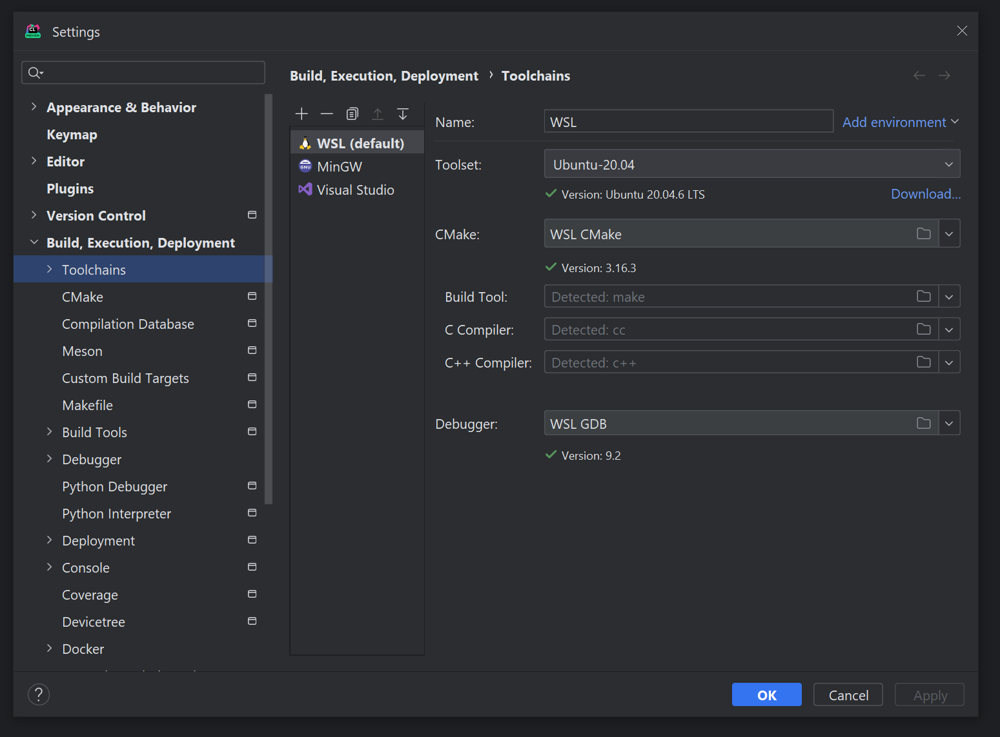

本文旨在分析一个具体的案例，而非 IDE 普遍的工作原理。<!--more-->

## CLion + WSL

### 配置说明

IDE：CLion Nova 2023.3 Early Access Program

系统：WSL2

```
Distributor ID: Ubuntu       
Description:    Ubuntu 20.04.6 LTS       
Release:        20.04                    
Codename:       focal    
```

工具链：




