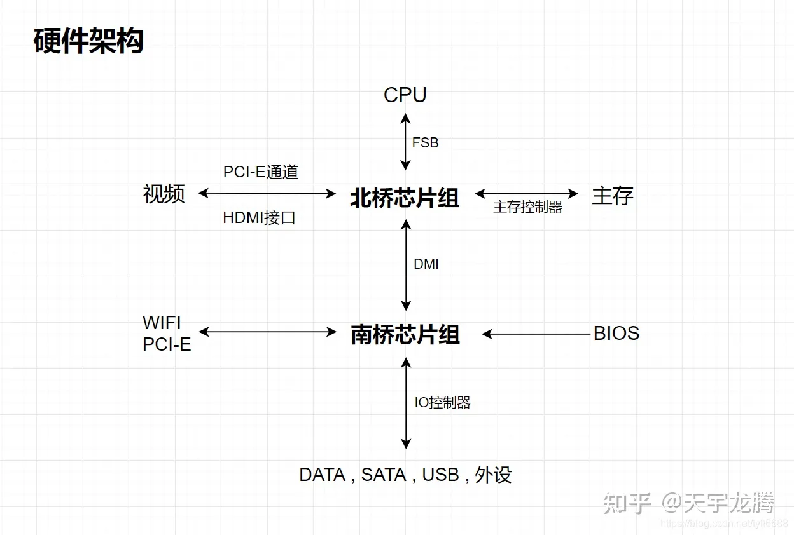
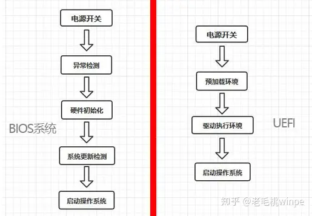
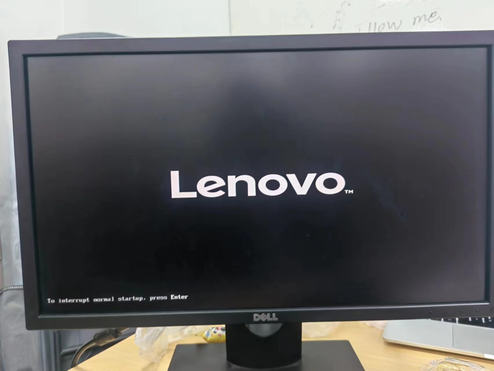
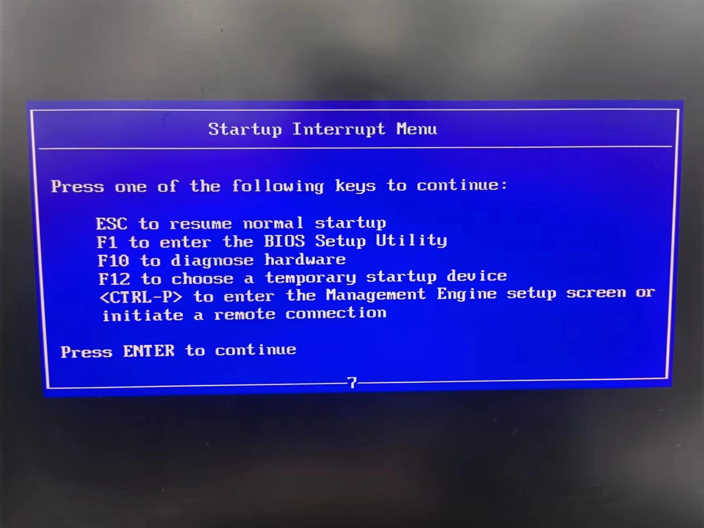
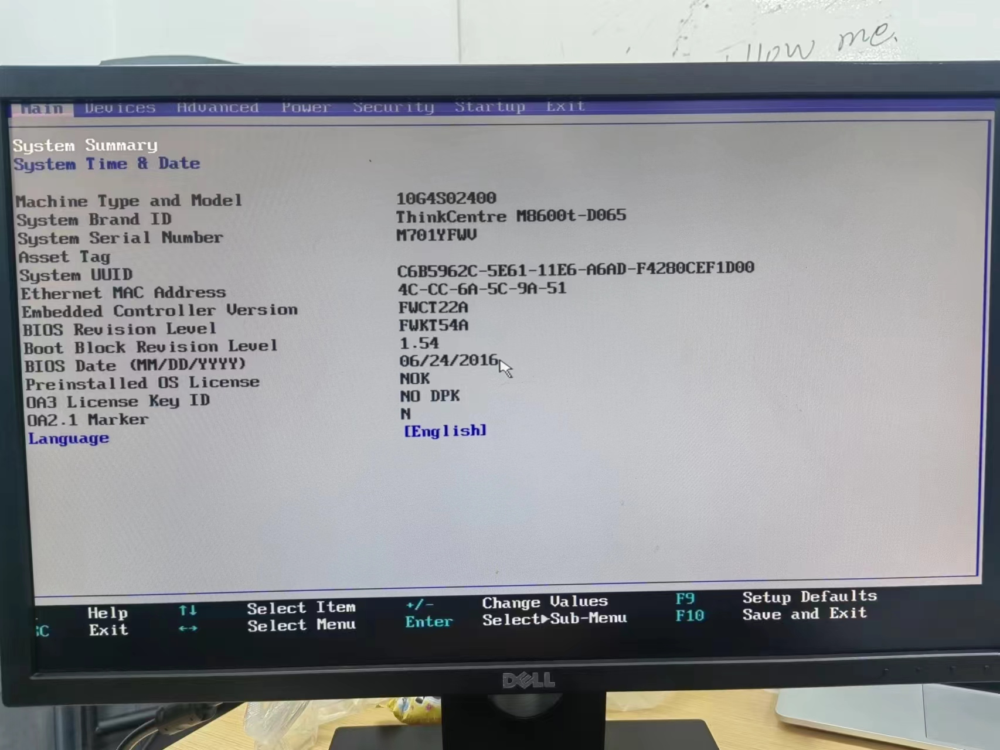

## 基本介绍

BIOS（英文：Basic Input/Output System），即基本输入输出系统，是在通电启动阶段执行**硬件初始化**，以及**为操作系统提供运行时服务**的**固件**。

> **固件**（英语：firmware），是一种嵌入在[硬件](https://zh.wikipedia.org/wiki/硬體)设备中的[软件](https://zh.wikipedia.org/wiki/軟體)。通常它是位于[特殊应用集成电路](https://zh.wikipedia.org/wiki/特殊應用積體電路)（ASIC）或[可编程逻辑器件](https://zh.wikipedia.org/wiki/可程式邏輯裝置)（PLD）之中的[闪存](https://zh.wikipedia.org/wiki/快閃記憶體)或[EEPROM](https://zh.wikipedia.org/wiki/EEPROM)或[PROM](https://zh.wikipedia.org/wiki/PROM)里，有的可以让用户更新。
>
> 顾名思义，固件的所在是位于软件和硬件之间的。像软件一样，他是一个被电脑所执行的程序。然而它是对于硬件内部而言更加贴近以及更加重要的部分，而对于外在的世界而言较无重要的意义。

<!--more-->

## BIOS 操作

### 系统启动

BIOS 是计算机开机之后，CPU要进行处理的第一个「可执行程序」，也就是第一个「开机启动项」。

当电脑的电源开启，BIOS 就会从主板上的 ROM 芯片执行，执行加电自检（POST），测试和初始化CPU、RAM、直接存储器访问控制器、芯片组、键盘、软盘、硬盘等设备。当所有的 Option ROM 被加载后，BIOS 就试图从启动设备（如硬盘、软盘、光盘）加载启动程序，由启动程序加载操作系统。BIOS 也可从网卡等设备启动。

### 设置界面

大约从 80386 PC 开始，个人电脑的 BIOS ROM 集成了设置程序（Setup）。主板的 CMOS 芯片用于存储 BIOS 设置值及硬件侦测值。主板上的钮扣电池用于让 CMOS 存储 BIOS 设置值，以及电脑在断电时依然可以让系统时钟运作。

现代的 BIOS 可以让用户选择由哪个启动设备启动电脑，如光盘驱动器、硬盘、软盘、U 盘等等。现代大多数 BIOS 支持图形化交互界面，有一些是厂商制作的，用户可以用鼠标键盘完成操作。

## BIOS 的加载顺序

BIOS 程序是用汇编语言编写，通电后，BIOS 首先连接到南桥(ESB)，然后是北桥(MCH)，最后连接 CPU。

> 北桥负责 CPU 与内存的数据交换、图形处理、CPU 与 PCIE 数据交换，南桥则负责系统的输入输出功能。
>
> 所以北桥芯片还有个名字叫“图形与内存控制器”，南桥叫“输入/输出控制器”。北桥芯片组因为与CPU联系密切所以它在主板靠近CPU的位置，而南桥芯片则在远离CPU的位置，所以我们是很好分辨北桥南桥的。
>
> 现在的CPU制造工艺越来越先进，集成度越来越高，内存控制器已被集成到CPU里，就连显卡也被收进CPU了（就是我们所说的核显），而PCIE控制器收归南桥管理了，因此北桥芯片组的功能被瓜分了，所以现在的Intel芯片组把北桥取消掉只剩南桥了，而AMD也只有早期的主板还保留着北桥和南桥。

## BIOS 芯片中的程序段

1. **自诊断程序**
   通过读取CMOSRAM中的内容，识别硬件配置，并对其进行自检和初始化。
2. **CMOS 设置程序**
   引导过程中，用特殊热键启动，进行设置后，存入 CMOS RAM 中。
3. **系统自检装载程序**
   在自检成功后，将磁盘 0 磁道 0 扇区上的引导程序装入内存，运行加载操作系统。
4. **主要 l/0 设备驱动程序和中断服务**

## 概念区分

### BIOS 与 UEFI

**统一可扩展固件接口**（英语：Unified Extensible Firmware Interface，缩写 **UEFI**）是一种[个人电脑](https://zh.wikipedia.org/wiki/個人電腦)系统规格，用来定义[操作系统](https://zh.wikipedia.org/wiki/作業系統)与系统[固件](https://zh.wikipedia.org/wiki/固件)之间的[软件界面](https://zh.wikipedia.org/wiki/介面_(程式設計))，作为[BIOS](https://zh.wikipedia.org/wiki/BIOS)的替代方案。可扩展固件接口负责 [加电自检](https://zh.wikipedia.org/wiki/加电自检)（POST）、联系操作系统以及提供连接操作系统与硬件的接口。

目前，电脑启动模式可以分为三种：

- 第一种：**BIOS 启动模式**，由于电脑主板的 BIOS 无法兼容 UEIF，只能使用 BIOS，这种情况一般出现在比较旧的电脑中。
- 第二种：**兼容性启动模式**，就是 CSM 兼容启动模式，是 UEFI 和传统 BIOS 两者共存模式，既能用传统 BIOS 引导模式，也能用新式 UEFI 启动电脑系统。比较主流。
- 第三种：**纯 UEFI 启动模式**，就字面上的意思，只能在UEFI引导模式来启动电脑系统。

现 UEFI 正在取代传统 BIOS，且 Intel 已经于 2020 年弃用传统 BIOS 接口，届时 Intel 产品不再支持基于 16 位[实模式](https://zh.wikipedia.org/wiki/真實模式)的 UEFI CSM（UEFI兼容性支持模块）。

### BIOS 与 ROM

首先，什么是 ROM：

- 狭义的 ROM：**只读存储器**（英语：Read-only memory，[缩写](https://zh.wikipedia.org/wiki/缩写)：**ROM**）是一种[半导体](https://zh.wikipedia.org/wiki/半導體)[存储器](https://zh.wikipedia.org/wiki/記憶體)，其特点是一旦在其体内存储了[资料](https://zh.wikipedia.org/wiki/資料)就无法再被改写或删除，但其存储过的内容也不会因为[电源](https://zh.wikipedia.org/wiki/電)关闭而丢失。

- 广义的 ROM：严格来讲，只读存储器指直接硬连接在计算机上的存储器可擦可编程只读存储器（EPROM）、电可擦可编程只读存储器（EEPROM）形式的半导体存储器可以被擦除和重新编程，但过程通常较慢，而且需要专门的设备，还只能擦写一定的次数。

  > 另外，ROM 还可以指[闪存](https://zh.wikipedia.org/wiki/快閃記憶體)，尽管后者除了“唯读”之外也能够“删除”体内资料。

早年，BIOS存储于 [ROM](https://zh.wikipedia.org/wiki/ROM) 芯片上；现在的BIOS多存储于[闪存](https://zh.wikipedia.org/wiki/快閃記憶體)芯片上，这方便了 BIOS 的更新。

与其说是谈 BIOS 的存储实现，不如说是 BIOS 作为固件的存储实现。

> 固件原本被存放在于 ROM 中，然而价格以及性能的需求已经让原件供应商妥协于其他的替代方案，包含了非易失性的媒体比如说 EEPROM 以及闪存或是 SRAM 的解决方案。

疑问：既然 BIOS 存储在 ROM 上，那它是怎么「记住」我们设置的各种选项的？

### BIOS 与 [CMOS ](https://zh.wikipedia.org/wiki/CMOS)

> **互补式金属氧化物半导体**（英语：**C**omplementary **M**etal-**O**xide-**S**emiconductor，[缩写](https://zh.wikipedia.org/wiki/縮寫)作 **CMOS**；简称**互补式金氧半导体**），是一种[集成电路](https://zh.wikipedia.org/wiki/積體電路)的设计[工艺](https://zh.wikipedia.org/wiki/製程)，可以在[硅质](https://zh.wikipedia.org/wiki/硅质)[晶圆](https://zh.wikipedia.org/wiki/晶圓)模板上制出[NMOS](https://zh.wikipedia.org/wiki/NMOS)（n-type MOSFET）和 [PMOS](https://zh.wikipedia.org/wiki/MOSFET)（p-type MOSFET）的基本器件，由于 NMOS 与 PMOS 在物理特性上为互补性，因此被称为 CMOS。

BIOS 与 CMOS 的关系：
CMOS 是计算机上另一个重要的存储器。之所以提到它，是因为 BIOS 程序的设置值、硬件参数侦测值就保存在 CMOS 中。而且，在 BIOS 程序启动计算机时，需要加载 CMOS 中的设置值。CMOS 通常被集成在南桥芯片组中。UEFI 系统则多用 NVRAM 存储设置。

BIOS 与 CMOS 的区别：
二者的区别是，BIOS 是存储在只读存储器（EEPROM 或闪存），而 CMOS 为随机存储器（RAM）；BIOS 中存储的是程序，而 CMOS 中存储的是普通信息。

CMOS 的内容在断电会消失。所以，把主板的电池拆出，便可重置其内容。另外，拆出电池也会重置时间。

## BIOS 实战

开机，根据提示或者主板型号进入 BIOS 设置界面：

这里以联想的某款主板为例，F1 进入 BIOS 页面：

在 BIOS 设置页面可以看到一些硬件信息以及设置选项，根据自己的需要进行选择。也可以随便玩一玩，退出时不保存更改就行了：

## 参考

[BIOS - 维基百科，自由的百科全书 (wikipedia.org)](https://zh.wikipedia.org/wiki/BIOS)

[固件 - 维基百科，自由的百科全书 (wikipedia.org)](https://zh.wikipedia.org/wiki/韌體)

[统一可扩展固件接口 - 维基百科，自由的百科全书 (wikipedia.org)](https://zh.wikipedia.org/wiki/統一可延伸韌體介面)

[互补式金属氧化物半导体 - 维基百科，自由的百科全书 (wikipedia.org)](https://zh.wikipedia.org/wiki/互補式金屬氧化物半導體)

[BIOS到底是什么 - 知乎 (zhihu.com)](https://zhuanlan.zhihu.com/p/89058949)

[主板上的南桥和北桥是什么意思？ - 知乎 (zhihu.com)](https://zhuanlan.zhihu.com/p/375804757)

[如何以简单正确的姿势理解“UEFI”和“BIOS”？ - 知乎 (zhihu.com)](https://zhuanlan.zhihu.com/p/72183751)