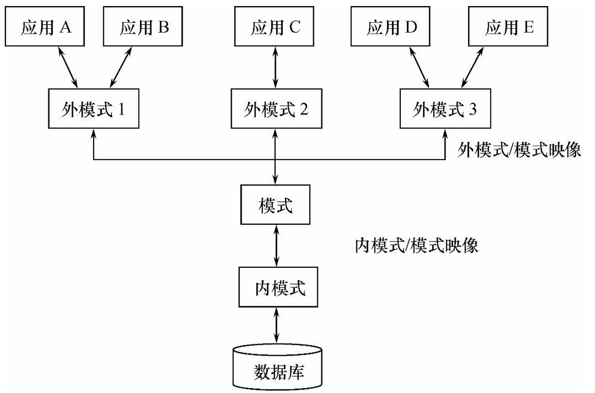
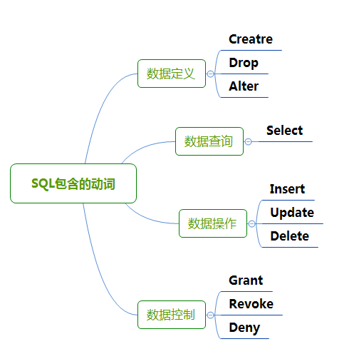

1. 单选 24
2. 多选 15
3. 判断 16
4. 应用题 21
5. 简答题 24

主观题、客观题各50分

# 第一章 绪论

- **数据库系统**的特点
- **三级模式**结构、**二级映象**

<!--more-->

## 数据库系统的特点

1. 数据结构化
2. 数据共享性高，冗余度低，容易扩展
3. 数据独立性高
   - 物理独立性
   - 逻辑独立性

## 三级模式

1. 外模式（子模式/用户模式）：数据库用户能够看见和使用的**局部数据**的**逻辑结构**和**特征**的描述，数据库用户的数据视图，是与**某应用有关**的数据的逻辑表示；
2. 模式（逻辑模式）：数据库中**全体数据**的**逻辑结构**和**特征**的描述，是所有用户的**公共数据视图**；
3. 内模式（存储模式）：数据**物理结构**和**存储方法**的描述，是数据在**数据库内部**的组织方式；



## 二级映象

1. 外模式/模式映像：保证了数据的**逻辑独立性**。当模式改变时，对外模式/模式的映像做出改变，保证外模式不变，应用程序由外模式编写，从而应用程序不变
2. 模式/内模式映像：保证了数据的**物理独立性**。当数据库的存储结构改变时，对模式/内模式映像做出改变，使模式不变，进而应用程序不变

# 第二章 关系数据库

- 熟练掌握**关系代数**各类运算

关系代数是关系数据库理论的一个基础部分，包含一组操作，用于从一个或多个关系中获取新的关系。这些操作包括集合操作和专门针对关系的操作。以下是常见的关系代数操作：

## 基本集合操作

1. **并集（Union, $ \cup $）**
   - 符号：$ R \cup S $
   - 描述：返回属于关系 $ R $ 或关系 $ S $ 或者同时属于 $ R $ 和 $ S $ 的所有元组。
   - 条件：$ R $ 和 $ S $ 必须具有相同的属性。
3. **差集（Difference, $ - $）**
   - 符号：$ R - S $
   - 描述：返回属于关系 $ R $ 但不属于关系 $ S $ 的所有元组。
   - 条件：$ R $ 和 $ S $ 必须具有相同的属性。
3. **选择（Selection, $ \sigma $​）**
   - 符号：$ \sigma_{\text{condition}}(R) $
   - 描述：返回满足指定条件的关系 $ R $ 中的所有元组。
   - 示例：$ \sigma_{\text{age} > 30}(R) $ 返回 $ R $ 中年龄大于30的所有元组。
4. **投影（Projection, $ \pi $）**
   - 符号：$ \pi_{\text{attribute list}}(R) $
   - 描述：返回关系 $ R $ 中指定属性的所有元组，去掉重复的元组。
   - 示例：$ \pi_{\text{name, age}}(R) $ 返回 $ R $ 中所有的名字和年龄。
5. **笛卡尔积（Cartesian Product, $ \times $）**
   - 符号：$ R \times S $
   - 描述：返回关系 $ R $ 和关系 $ S $ 的所有可能的元组组合。

## 专门的关系操作

1. **交集（Intersection, $ \cap $）**
   - 符号：$ R \cap S $
   - 描述：返回同时属于关系 $ R $ 和关系 $ S $ 的所有元组。
   - 条件：$ R $ 和 $ S $ 必须具有相同的属性。
2. **自然连接（Natural Join, $ \bowtie $）**
   - 符号：$ R \bowtie S $
   - 描述：返回两个关系 $ R $ 和 $ S $ 中那些在共有属性上值相等的元组的组合。
3. **条件连接（Theta Join, $ \bowtie_{\text{condition}} $）**
   - 符号：$ R \bowtie_{\text{condition}} S $
   - 描述：返回两个关系 $ R $ 和 $ S $ 中满足指定条件的元组的组合。
   - 示例：$ R \bowtie_{\text{R.id} = \text{S.id}} S $ 返回 $ R $ 和 $ S $ 中 id 相等的元组。
4. **外连接（Outer Join）**
   - **左外连接（Left Outer Join, $ \bowtie_{\text{left}} $）**
     - 符号：$ R \bowtie_{\text{left}} S $
     - 描述：返回关系 $ R $ 和 $ S $ 中那些在共有属性上值相等的元组，以及 $ R $ 中没有匹配的元组。
   - **右外连接（Right Outer Join, $ \bowtie_{\text{right}} $）**
     - 符号：$ R \bowtie_{\text{right}} S $
     - 描述：返回关系 $ R $ 和 $ S $ 中那些在共有属性上值相等的元组，以及 $ S $ 中没有匹配的元组。
   - **全外连接（Full Outer Join, $ \bowtie_{\text{full}} $）**
     - 符号：$ R \bowtie_{\text{full}} S $
     - 描述：返回关系 $ R $ 和 $ S $ 中那些在共有属性上值相等的元组，以及 $ R $ 和 $ S $ 中没有匹配的元组。
5. **除法（Division, $ \div $）**
   - 符号：$ R \div S $
   - 描述：返回关系 $ R $ 中那些对于 $ S $ 中的每一个元组在 $ R $ 中都有对应的元组。

# 第三章 SQL

- 熟悉**索引**的分类、使用
- 熟练掌握 **SQL** 常用命令的使用
- **聚集函数**的使用
- **视图**的基本操作、特点

## 索引

SQL中的索引用于提高数据库查询性能。它们通过在一列或多列上创建一种快速查找结构，减少查询扫描的行数。索引的类型和使用方法如下：

分类：

1. **主键索引（Primary Key Index）**：

   聚集索引，是物理索引

   - 每个表只能有一个主键索引。

   - 主键索引自动创建，唯一且不能为NULL。

   - 示例：

     ```
     sqlCopy codeCREATE TABLE employees (
         id INT PRIMARY KEY,
         name VARCHAR(100),
         department VARCHAR(100)
     );
     ```

2. **唯一索引（Unique Index）**：

   - 确保索引列中的所有值都是唯一的。

   - 可以有多个唯一索引。

   - 示例：

     ```
     sql
     Copy code
     CREATE UNIQUE INDEX idx_unique_name ON employees(name);
     ```

3. **复合索引（Composite Index）**：

   - 在多个列上创建的索引，提高多列查询的性能。

   - 示例：

     ```
     sql
     Copy code
     CREATE INDEX idx_name_department ON employees(name, department);
     ```

索引的使用：
1. **创建索引**：

   - 在现有表上创建索引：

     ```
     sql
     Copy code
     CREATE INDEX idx_name ON employees(name);
     ```

2. **查看索引**：

   - 显示表的索引：

     ```
     sql
     Copy code
     SHOW INDEX FROM employees;
     ```

3. **删除索引**：

   - 删除索引：

     ```
     sql
     Copy code
     DROP INDEX idx_name ON employees;
     ```

4. **使用索引进行查询优化**：

   - 使用索引的查询示例：

     ```
     sql
     Copy code
     SELECT * FROM employees WHERE name = 'John';
     ```

   - 索引在`WHERE`子句、`ORDER BY`子句、`GROUP BY`子句和连接操作中能提高查询性能。

## 常用 SQL

SQL（结构化查询语言）是一种用于管理和操作关系型数据库的标准语言。常用的SQL语句分为以下几类：



### 数据定义语言（DDL）
用于定义和修改数据库结构，如创建、修改和删除表和索引等。

1. **创建数据库**：
   ```sql
   CREATE DATABASE database_name;
   ```

2. **删除数据库**：
   ```sql
   DROP DATABASE database_name;
   ```

3. **创建表**：
   ```sql
   CREATE TABLE table_name (
       column1 datatype,
       column2 datatype,
       ...
   );
   ```

4. **删除表**：
   ```sql
   DROP TABLE table_name;
   ```

5. **修改表**：
   - 添加列：
     ```sql
     ALTER TABLE table_name ADD column_name datatype;
     ```
   - 删除列：
     ```sql
     ALTER TABLE table_name DROP COLUMN column_name;
     ```
   - 修改列：
     ```sql
     ALTER TABLE table_name MODIFY COLUMN column_name new_datatype;
     ```

### 数据操作语言（DML）
用于操作数据库中的数据，包括插入、更新、删除和查询数据。

1. **插入数据**：
   ```sql
   INSERT INTO table_name (column1, column2, ...)
   VALUES (value1, value2, ...);
   ```

2. **更新数据**：
   ```sql
   UPDATE table_name
   SET column1 = value1, column2 = value2, ...
   WHERE condition;
   ```

3. **删除数据**：
   ```sql
   DELETE FROM table_name
   WHERE condition;
   ```

4. **查询数据**：
   ```sql
   SELECT column1, column2, ...
   FROM table_name
   WHERE condition;
   ```

### 数据查询语言（DQL）
主要用于查询数据库中的数据。

1. **简单查询**：
   ```sql
   SELECT column1, column2
   FROM table_name;
   ```

2. **条件查询**：
   ```sql
   SELECT column1, column2
   FROM table_name
   WHERE condition;
   ```

3. **排序**：
   ```sql
   SELECT column1, column2
   FROM table_name
   ORDER BY column1 [ASC|DESC];
   ```

4. **分组**：
   ```sql
   SELECT column1, COUNT(*)
   FROM table_name
   GROUP BY column1;
   ```

5. **连接查询**：
   - 内连接：
     ```sql
     SELECT a.column1, b.column2
     FROM table1 a
     INNER JOIN table2 b ON a.common_column = b.common_column;
     ```
   - 左连接：
     ```sql
     SELECT a.column1, b.column2
     FROM table1 a
     LEFT JOIN table2 b ON a.common_column = b.common_column;
     ```
   - 右连接：
     ```sql
     SELECT a.column1, b.column2
     FROM table1 a
     RIGHT JOIN table2 b ON a.common_column = b.common_column;
     ```
   - 全连接：
     ```sql
     SELECT a.column1, b.column2
     FROM table1 a
     FULL OUTER JOIN table2 b ON a.common_column = b.common_column;
     ```

### 数据控制语言（DCL）
用于控制对数据库的访问权限。

1. **授予权限**：
   ```sql
   GRANT privilege_name ON object_name TO user_name;
   ```

2. **收回权限**：
   ```sql
   REVOKE privilege_name ON object_name FROM user_name;
   ```

### 示例
假设有一个名为`employees`的表，包含以下列：`id`, `name`, `department`, `salary`。

1. **创建表**：
   ```sql
   CREATE TABLE employees (
       id INT PRIMARY KEY,
       name VARCHAR(100),
       department VARCHAR(100),
       salary DECIMAL(10, 2)
   );
   ```

2. **插入数据**：
   ```sql
   INSERT INTO employees (id, name, department, salary)
   VALUES (1, 'John Doe', 'IT', 60000.00);
   ```

3. **查询数据**：
   ```sql
   SELECT * FROM employees;
   ```

4. **更新数据**：
   ```sql
   UPDATE employees
   SET salary = 65000.00
   WHERE id = 1;
   ```

5. **删除数据**：
   ```sql
   DELETE FROM employees
   WHERE id = 1;
   ```

这些是常用的SQL语句，通过这些基本操作，可以进行数据库的创建、管理和数据操作。

## 聚集函数

SQL中的聚集函数（Aggregate Functions）用于对一组值执行计算，并返回单个值。这些函数通常与`GROUP BY`子句结合使用，以便对数据进行分组和汇总。以下是一些常见的聚集函数及其用法：

1. **COUNT()**：计算某列中的行数。

   ```
   sql
   Copy code
   SELECT COUNT(*) FROM employees;
   ```

   返回`employees`表中所有行的总数。

2. **SUM()**：计算某列中所有数值的总和。

   ```
   sql
   Copy code
   SELECT SUM(salary) FROM employees;
   ```

   返回`employees`表中`salary`列所有值的总和。

3. **AVG()**：计算某列中所有数值的平均值。

   ```
   sql
   Copy code
   SELECT AVG(salary) FROM employees;
   ```

   返回`employees`表中`salary`列所有值的平均值。

4. **MIN()**：返回某列中的最小值。

   ```
   sql
   Copy code
   SELECT MIN(salary) FROM employees;
   ```

   返回`employees`表中`salary`列的最小值。

5. **MAX()**：返回某列中的最大值。

   ```
   sql
   Copy code
   SELECT MAX(salary) FROM employees;
   ```

   返回`employees`表中`salary`列的最大值。

6. **GROUP_CONCAT()**：将某列中的值连接成一个字符串。

   ```
   sql
   Copy code
   SELECT GROUP_CONCAT(name) FROM employees;
   ```

   返回`employees`表中`name`列的所有值连接成的字符串。

使用示例：

假设有一个名为`employees`的表，包含以下列：`id`, `name`, `department`, `salary`。我们可以使用聚集函数来获取每个部门的工资总和和平均值：

```
sqlCopy codeSELECT department, SUM(salary) AS total_salary, AVG(salary) AS average_salary
FROM employees
GROUP BY department;
```

这条查询将返回每个部门的工资总和和平均值。

## 视图

在SQL中，视图是一个虚拟表，它的内容是根据SQL查询定义的。视图可以让你简化复杂查询的使用，使数据访问更加方便。以下是创建和查询视图的基本步骤：

### 创建视图

要创建视图，你可以使用`CREATE VIEW`语句。语法如下：

```sql
CREATE VIEW 视图名 AS
SELECT 列1, 列2, ...
FROM 表名
WHERE 条件;
```

举个例子，假设你有一个名为`employees`的表，包含`id`, `name`, `salary`, `department`等列。你想创建一个视图，显示工资超过5000的员工信息：

```sql
CREATE VIEW high_salary_employees AS
SELECT id, name, salary
FROM employees
WHERE salary > 5000;
```

### 查询视图

创建视图后，可以像查询表一样查询视图。语法如下：

```sql
SELECT 列1, 列2, ...
FROM 视图名
WHERE 条件;
```

例如，要查询刚刚创建的视图`high_salary_employees`中的所有数据：

```sql
SELECT *
FROM high_salary_employees;
```

### 更新视图

某些情况下，你可以更新视图中的数据。不过，视图是否可以更新取决于视图的定义和数据库管理系统（DBMS）的支持。如果视图可以更新，语法如下：

```sql
UPDATE 视图名
SET 列 = 新值
WHERE 条件;
```

例如，更新视图中某个员工的工资：

```sql
UPDATE high_salary_employees
SET salary = 6000
WHERE id = 1;
```

### 删除视图

如果不再需要视图，可以使用`DROP VIEW`语句删除视图。语法如下：

```sql
DROP VIEW 视图名;
```

例如，删除`high_salary_employees`视图：

```sql
DROP VIEW high_salary_employees;
```

这些是创建和查询视图的基本操作。视图的使用可以帮助你简化复杂的查询，并提高数据管理的灵活性和安全性。

**特点**：视图是基于查询的虚拟表，可以简化复杂查询，提供数据的安全性和独立性。

# 第四章 数据库安全性

- 了解**自主存取控制**的实现方法

自主存取控制方法：定义各个用户对不同数据对象的存取权限。当用户对数据库访问时首先检查用户的存取权限。防止不合法用户对数据库的存取。

强制存取控制方法：每一个数据对象被(强制地)标以一定的密级，每一个用户也被(强制地)授予某一个级别的许可证。系统规定只有具有某一许可证级别的用户才能存取某一个密级的数据对象。

# 第五章 数据库完整性

- 掌握**三类完整性**的定义方法

## 实体完整性

主码唯一且非空。

```sql
PRIMARY KEY(列名1, 列名n)
```

检查与违约处理：检查主码是否唯一，如果不唯一则拒绝插入或修改；检查主码各个属性是否为空，只要有一个为
空就拒绝插入或修改

## 参照完整性

外码的约束。

```sql
FOREIGN KEY(列名) REFERENCES 被参照表(列名)
```

检查：对被参照表和参照表进行增删改操作时可能会破坏参照完整性，必须检查以保证两个表的相容性
违约处理：外码约束可以在创建参照表时说明不同的违约策略

## 用户定义完整性

属性上约束条件的定义

```sql
CREATE TABLE 课程
(
课程号 CHAR(6) PRIMARY KEY,
课程名 CHAR(10) UNIQUE,
先行课号 CHAR(6)
课程类型 CHAR(6) NOT NULL, CHECK(课程类型 IN（’选修’，’必修’))，
学分 INT, 
FOREIGN KEY(先行课号) REFERENCES 课程(课程号)，
CHECK( 课程类型=’必修’ OR 学分<=3)
)	
```

1、属性上的约束条件
非空NOT NULL
列值唯一UNIQUE
检查列值是否满足一个表达式CHECK
检查和违约处理：当向表中插入元组或者修改属性值时，关系数据库管理系统将检查属性上的约束条件是否被满足，
如果不满足则操作被拒绝
2、元组上的约束条件
在CREATE TABLE语句中可以用CHECK短语定义元组上的约束条件，元组级的限制可以设置不同属性之间的取值
的相互约束条件
检查和违约处理：当向表中插入元组或者修改属性值时，关系数据库管理系统将检查元组上的约束条件是否被满足，
如果不满足则操作被拒绝

# 第六章 关系数据理论

- 求候选码
- 熟练掌握从 1NF 到 BCNF 的概念
- 对给定的**关系模式**，会判定**范式级别**

## 范式

1. **第一范式（1NF）**：所有属性值必须是原子值，不可再分。
2. **第二范式（2NF）**：在 1NF 的基础上，非主属性**完全依赖**于主键。
3. **第三范式（3NF）**：在 2NF 的基础上，**消除**非主属性对主键的**传递依赖**。
4. **巴斯-科德范式（BCNF）**：在 3NF 的基础上，任何非平凡的函数依赖X->Y中，X必须是超级键。

简答：请简述“规范化”理论主要应用在数据库设计的那个阶段？“规范化”理论的优化目标是什么？在“规范化”理论中提高一个关系模式范式等级的具体方法是什么？在对数据库设计进行优化时，是否规范化程度越高越好，给出判断并阐明原因？

答：

1. “规范化”理论主要应用在数据库逻辑结构设计阶段（对全局逻辑结构进行优化）。（1分）
2. “规范化”理论的优化目标是：消除数据冗余、各类操作异常。（1分）
3. 在“规范化”理论中提高一个关系模式范式等级的具体方法是：对关系模式进行分解，消除属性间不好的数据依赖关系（函数，非函数）。（1分）
4. 否。（1分）因为随着范式等级的提高，查询效率会减低。（1分）主要原因是：规范化的基本思想是将关系模式进行拆分，使其中不属于同一主题的数据项“分离”。而用户的查询经常涉及到多个表的数据，如果规范化程度过高（数据过于分离），查询中会涉及大量表的连接操作，导致较高的查询开销和较低的查询效率。（1分）

# 第七章 数据库设计

- 重点掌握**概念设计**与**逻辑设计**两个阶段的任务
- 给出语义会画 **ER 图**
- 会将 **ER 图** 转化为对应的**关系模式**

数据库设计是创建一个有效且高效的数据库系统的关键过程。以下是数据库设计的主要步骤：

## 1. **需求分析**
在这个阶段，数据库设计师需要与客户或最终用户沟通，了解他们的需求和期望。目标是明确数据库需要存储哪些数据，以及这些数据将如何使用。

**步骤：**
- 收集需求：与利益相关者会面，收集关于数据库需求的信息。
- 分析需求：分析收集到的信息，确定数据库需要支持的功能和数据。
- 文档化需求：将需求记录在文档中，以便在设计和开发过程中参考。

## 2. **概念设计**
在概念设计阶段，使用高层次的数据模型（如实体-关系图，ER图）来表示数据库的逻辑结构。这一步不涉及具体的数据库实现细节。

**步骤：**
- 确定实体：确定数据库中需要存储的主要实体（如客户、订单、产品等）。
- 定义属性：为每个实体定义属性（如客户的姓名、地址、电话等）。
- 确定关系：定义实体之间的关系（如客户和订单之间的关系）。
- 创建ER图：使用图形工具创建ER图，表示实体、属性和关系。

## 3. **逻辑设计**
逻辑设计将概念设计转换为特定数据库管理系统（DBMS）支持的逻辑模型（如关系模型）。这一步确定具体的表结构、列、数据类型和约束。

**步骤：**
- 将ER图转换为关系模型：将实体和关系转换为表和外键。
- 定义表结构：为每个实体创建表，并定义列和数据类型。
- 设置约束：定义主键、外键、唯一性约束和其他完整性约束。

## 4. **物理设计**
在物理设计阶段，确定如何在硬件上实现数据库。这包括选择存储结构、索引、分区等，以优化数据库的性能和存储效率。

**步骤：**
- 选择存储结构：决定表和索引的存储方式。
- 创建索引：根据查询需求创建适当的索引。
- 分区设计：对于大规模数据库，设计表分区以提高性能。
- 配置数据库参数：调整数据库参数以优化性能。

## 5. **实施**
在实施阶段，使用具体的DBMS（如MySQL、PostgreSQL、Oracle）来创建数据库和相关对象（如表、视图、存储过程）。

**步骤：**
- 创建数据库：在DBMS中创建数据库。
- 创建表和约束：根据逻辑设计创建表和约束。
- 创建索引：根据物理设计创建索引。
- 导入数据：将初始数据导入数据库。

## 6. **测试和验证**
在测试和验证阶段，确保数据库设计满足所有需求，并且数据库操作正常运行。测试可能包括功能测试、性能测试和安全测试。

**步骤：**
- 功能测试：验证数据库是否按预期工作。
- 性能测试：评估数据库在高负载下的性能。
- 安全测试：检查数据库的安全性，确保数据安全。

## 7. **维护和优化**
数据库设计完成并投入使用后，定期维护和优化是必要的，以确保数据库持续高效运行。

**步骤：**
- 监控性能：使用监控工具跟踪数据库性能。
- 进行优化：根据监控结果进行必要的优化，如调整索引、优化查询等。
- 备份和恢复：定期备份数据库，制定恢复计划以应对数据丢失。

通过遵循这些步骤，可以设计出一个结构合理、高效且满足需求的数据库系统。