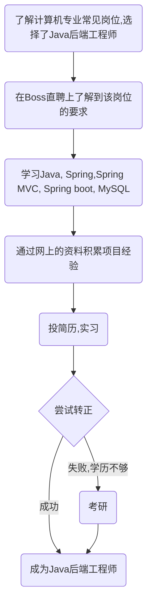

最近有学弟学妹问我学习方向、学习方法、未来规划之类的问题。诚然，我只是一个平常学校的大二学生，本身还在学习，自觉没有太多宝贵的经验可以分享。既然都问到我头上了，我也不好故作谦虚而缄口不言，只能姑妄讲之，各位大可姑妄听之，不必奉为圭臬。

## 为什么读大学（对人生的规划）

当遇见这样的问题：大学怎么过，比赛怎么打，工作怎么找······，我们不禁追问：为什么要做这些，为什么要读大学，甚至，你想要过怎样的人生？这些表面问题的答案，往往隐藏在更深层次的原因之中。不去深入地认识自己、认识世界，自然难以得到令自己心悦诚服的结论。

<!--more-->

以下是我对这个问题的回答，主要是三个方面：

- 深层原因：追求人格的完善。如《大学》所言：「大学之道，在明明德，在亲民，在止于至善」，「自天子以至于庶人，壹是皆以修身为本」；也如毛姆《刀锋》所言：「我认为一个人能够追求的最高理想是自我的完善」。
- 直接原因：学到用于工作的技能，赚钱，体验精彩独特的生活。
- 归纳原因：根据以往的经验，读大学往往有不错的收获。

这是最根本的问题，然而对它的思考需要环境的推动，也需要个人的悟性。你对自己的认识、对世界的认识决定了你想要什么样的结果。

## 对结果的规划

最终的结果大概只有两类：业界和学界。硬要在加上一类，便是公务员。要想加入其中，首先要了解它的运行规则，而非靠凭空想象。一个很显然的事实是：重复前辈的经历，大概能得到相似的结果；而前辈们往往探索完了你所有可能的道路。

这两类（三类）才是最终的结果，所谓读本科、读研、实习等等，无非都是为这三类目标而去的。

我目前的认识是：每个行业的老板、HR、导师，都想招跟自己相同的人来帮自己做事。因此如果你想去业界，就去了解现在的工作岗位，工作内容，进入公司实习；如果你想去学术界，则去了解现在的科研趋势，读论文，写论文。

归根结底，你未来想要干什么，便直接成为那类人，现在就做那些事。反过来说，你现在做的事、未来要做的事，都是为了你最终想要的那个结果。

## 对过程的规划

正常的步骤是：在明白自己想要什么样的结果之后，通常会有一些相似的达成过程，也可以以此划分短期目标。

本科毕业前后常见的短期目标有：

- 实习
- 考研
- 保研
- 出国
- 考公

其中实习、考研偏向于业界，保研、出国偏向于学界。

然而这些都只是中间步骤，部分同学却错误地把这些当成了最终的结果。

以工作为例，一个可能的规划是这样的：

其他的道路也是类似。

## 对常见话题的看法

根据前文提到的观点：「重复前辈的经历，大概能得到相似的结果；而前辈们往往探索完了你所有可能的道路」。我们一定在（不自觉地）模仿某一类前辈，但其实我们完全可以了解往届学生的经历和去向，并有意识地选择其中的一类进行模仿。

在了解和模仿的过程中，经常会碰到一些难以避免的话题，以下是我对它们的看法。

### 上课

我曾经觉得：上课教的东西与业界严重脱节，根本没什么用。听课也往往是一副吊儿郎当的样子，听不进就玩玩手机，课后再学感兴趣、有用的东西。

后来我意识到：一方面，课上教的东西虽然确实有很多与业界脱节，但仍然有很多经久不衰的**思想**和**技术**；更重要的是，不仅仅是学到的东西有用，**专注**学习的过程本身就是很宝贵的东西。

总之，要么逃课自学，要么上课认真听讲，尽量不要上课摆烂。

### 绩点

绩点只有两个用途：保研和出国。如果你决定保研或出国，绩点只是部分因素，你应该积极地了解所在学院的保研（交换）政策和目标学院的招生政策，尽自己所能地满足条件。

如果既不打算保研，又不打算出国，那么你不应该让绩点过多影响其他的进程。即便如此，你也应该保持正常的课堂学习以及正常的绩点。

### 比赛

比赛与比赛之间的差距非常大，其中很多比赛都是出于莫名其妙的原因而存在，要参与比赛，首先要明确自己的目的：

- 为了保研：保研要求明确指出某些比赛可以加分，哪怕它们从上到下都是一个巨大的草台班子。想要保研的同学去迎合这种比赛可以理解，其他同学则最好三思而行；
- 为了锻炼技术：诚然，比赛比理论更偏向于实际，但这并不意味着它符合业界的实际；在参与的过程中应该明确自己锻炼水平的根本目的，不应过分迎合比赛；相较而言，公司的实习是更实战的选择。
- 因为某种兴趣：既然都有兴趣了，比赛只是一个媒介，比不比赛你都会学的，对吧？
- 因为大家都在参加：俗话说就是被卷到了，却不知道自己究竟要干什么，只能人云亦云地跟风参加；这种情况可以参加比赛，但只是权宜之计，更重要的是找到自己真正的目标。

### 学长、老师、导员

你大概离不开走学长的老路，认识他们，利用好他们会对你会有莫大的帮助。比自己高一两级的学长学姐、同专业读研读博的学长学姐，都可以认识一下。例如对他们来说，转给你某门课程上一年期末考试的笔记和重点只是顺手的事，对你却是天大的帮助。

大学老师可能是你这辈子所能见到社会地位最高的一群人，你拼死拼活也很难达到他们如今的位置。最好去学校的官网认识所在学院的所有老师，可以通过各种各样的渠道认识老师，认识老师的目的，是最终找到合适的老师，与其合作：他出资源，你出力，双赢。

导员则更了解政策方面的事项，没事可以去聊聊天、唠唠嗑、刷刷好感。

### 项目组

也称实验室，主要是研究某个方向的导师和他的研究生，有时也会招收本科生帮忙做事。作为本科生需要意识到自己进组的目的：认识学长学姐？做项目？发论文？而进组、进实验室的本质就是通过自己的劳动力，交换相应的资源和帮助。

### 实习与科研

最实战的一集。我认为本科阶段最有含金量的两件事，一个是实习（工作经历），另一个是发论文（科研经历），两种不同的经历也对应了业界和学界的道路。通常来说，这两类经历无论对于找工作还是对于研究生录取都是很有帮助的。

## 总结

本文以一种结果导向的视角从人生规划、结果规划、过程规划三个方面递进的分析了大学如何规划，并额外讨论了作者对于大学中常见话题的看法。

需要注意的是，这样一种「结果导向」的视角并不一定总是合理的，本文较多讨论了学业、工作方面的内容，规避了大学中同样十分重要的社交和娱乐，这是因为作者并不擅长这些方面。「过程导向」的视角同样具有其独特意义，自我的提升和当下的专注也是人生中的宝贵财富，希望读者能够辩证地看待。

## 相关链接

[上海交通大学生存手册](https://survivesjtu.gitbook.io/survivesjtumanual)

[钱理群：如何度过大学四年？ - 知乎 (zhihu.com)](https://zhuanlan.zhihu.com/p/19882713)

[CS 自学指南](https://csdiy.wiki/)

[ChatGPT](https://chat.openai.com/)

[提问的智慧](https://github.com/ryanhanwu/How-To-Ask-Questions-The-Smart-Way/blob/main/README-zh_CN.md)（**本指南不提供此项目的实际支持服务**）