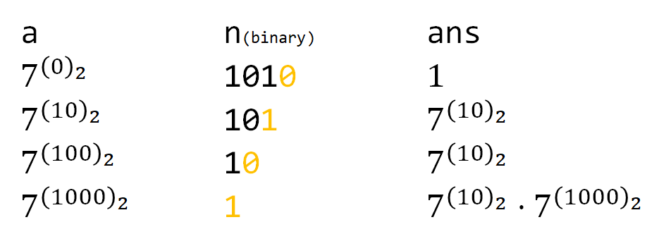

对于 $ a^n$，如果用一个 n 次，每次乘 a 的循环来计算，时间复杂度为 $O(n)$。<!--more-->

然而每次算一个这么小的数，重复算这么多次，也太屈计算机之才了。借用二分的思维，每次都把 n 对半分，就可以优化到 $O(\log n)$。

然而这还是不够，一方面不是每次 n 都可以对半分，奇偶讨论很麻烦；另一方面递归会占用额外的内存。这时候就可以**把二分和二进制联系起来**：n 可以被表示为二进制形式，因此 $a^n$ 可以被转化为许多可被二分的数的连乘，此时就非常方便表示了。

以下是快速幂的代码：

```cpp
int qpow(int a, int n) {
    int ans = 1;
    while(n) {
        if (n & 1) ans *= a;
        a *= a;
        n >>= 1;
    }
    return ans;
}
```

此外

* 如需取模，步步取模，注意开 `long long`（其实大多都要取模，不然直接用 `pow()` 函数了）;
* 不仅是快速幂，类似的运算也可以用到这样**二分联系二进制**的思想。

参考[知乎 Pecco](https://zhuanlan.zhihu.com/p/95902286) 

