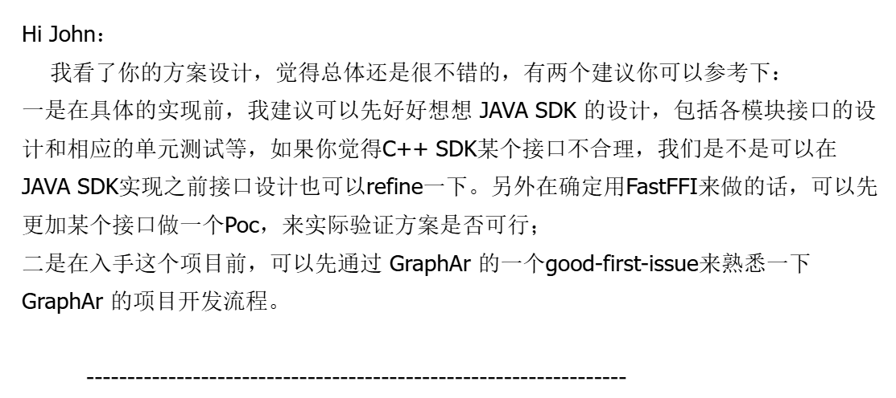

# 简介

本人菜鸡一枚, 参加过 OSPP 2023 和 GLCC 2024, 侥幸被评为了 OSPP 优秀学生. 后来又到了申请 OSPP 的时候, 有一些同学让我分享申请 OSPP 的经验, 实在诚惶诚恐,  只好姑妄讲之, 希望能对看到的同学有所帮助.

要说明的是, 这篇文章倾向于个人经验的分享, 推荐**优先精读**这篇官方的 [项目申请通关秘籍](https://blog.summer-ospp.ac.cn/help/student%20application%20advice).

<!--more-->

# 经验分享

回想第一次参加 OSPP 的时候, 我把写好的 proposal (项目申请书) 发给意向项目的 mentor (导师), 请他给我提一些修改意见, 然后得到了他这样的回复:

mentor 给我的邮件回复(部分)

从中可以看出三点:

1. mentor 建议我做一个 [POC (概念验证)](https://zh.wikipedia.org/wiki/%E6%A6%82%E5%BF%B5%E9%AA%8C%E8%AF%81);
2. mentor 建议我尝试解决一些社区任务;
3. mentor 比较上心, 愿意引导学生.

由此展开, 我主要想由近及远地从项目实现, 获取信任, 长期发展三个层面分享我个人申请 OSPP 的一些经验.

## 项目实现: 做一个 POC

建议做一个 POC, 因为:

1. 第一可以明确方向, 避免踩坑;
2. 第二可以向 mentor 展示自己的能力和对项目的理解 ;
3. 第三可以把这个 POC 写进项目申请书里, 提高竞争力.

POC 可以翻译为「可行性验证」或「概念验证」, 在此可以理解为「先做一个 Demo」出来看看. 据我观察, 大部分的项目都可以做一个 POC, 只有极少的项目不适合/不需要做.

有人可能要问了, OSPP 不是不建议在中选之前开始开发吗? 确实是这样, 但这是为了避免学生用力过猛. OSPP 同样建议在 proposal 中给出详细的技术方案, 甚至写到二三十页都不过分, 这是为了避免学生投入的精力过少. 在「用力过猛」和「发力不足」之间, 「做一个 POC」就是那个恰到好处的平衡点.

既然是「可行性验证」, 需要学生能够在理解项目需求和提出技术方案的基础上, 给出并完成一个验证点, 具体来说主要是一下三步:

1. 明确可行性验证的目标, 并说明这个目标的合理性;
2. 建立验证流程, 并实现相应代码;
3. 得出验证结果, 并说明结果符合了要验证的目标.

在 proposal 中加入演示代码是很常规的操作, 但 POC 更进一步的地方在于: 这个演示代码是可以跑的. 因此我有一个额外的建议: 把完整的, 可运行的 POC 提到 GitHub, 在 README 中详细地说明运行步骤, 然后把链接发给 mentor, 让他亲手跑一跑.

## 获取信任: 从参与贡献开始

要获取导师/社区的信任, 最好的办法就是修 issue, 提 PR, 并在此过程中完成和导师/社区的合作.

对于一个学生/参与开源的新人, issue 和 PR 下面的评论区是很好的和导师/社区里其他人交流的地方. 从导师/社区的角度来看, 他们也更愿意选择一个有过共事经验的合作伙伴. 

参与贡献主要是两个部分: 需求(issue)和实现(PR), 在此过程中, 随时 @ 你要申请项目的 mentor, 多问问他这里行不行, 那里怎么改, 在交流中推进彼此的熟悉.

先说需求, 这在开源社区中一般体现为 issue, 很多社区里都会提供一些 good-first-issue, 这些 issue 相对容易, 对想要加入的新人比较友好. 如果现有的 issue 上手难度比较高, 实在做不来, 没有 issue 也可以创造 issue, 最不济可以改改文档什么的.

再说实现, 这在开源社区中一般体现为 PR, 很多社区会有「如何参与贡献」的文档(一定要读! 可能包含了 PR 格式要求, 代码格式要求等), 学生可以在此过程中熟悉社区的工作流程和其他规范.

学生参与贡献, 就是为了适当获取导师和社区的信任, 提高中选概率.

<!--延伸一下, 古人说「攻心为上, 攻城为下」, 举正反两个我亲身经历过的开源社区的例子: 同学 A 想要申请「实现协议 a」的课题, 申请过程中提了一个大几千行的 PR 把和协议 a 相关的协议 b 实现了, 充分展示了自己的能力, 最后毫无疑问地中选了; 同学 B 在某个社区参与过一年, 和社区里的人比较熟悉, 草草写了一下 proposal 就中选了项目, 可惜最后实现的过程中不是很上心, 只是勉强结项. 由此可见「获取信任」的重要性: 学生不必闷头做事, 可以适当获取导师/社区的信任; 导师/社区也不应任人唯亲, 应该多看看学生到底做了什么, 合作的意愿如何.-->

## 长期发展: 选择合适的项目/导师/社区

作为学生, 不要紧盯着 OSPP 那 8k/12k 的钱, 更要看看哪些项目/导师/社区适合长期发展.

项目的长期发展好理解, 举个最简单的例子: LLM 是现在的热点, 无疑完成 LLM 相关的项目写在简历上也是很吸引眼球的, 因此也可以料见 LLM 的项目会很抢手. 然而并不是每一个人都要去做 LLM, 最重要的是避开竞争过大的课题, 选择和自己的长期发展契合的方向.

导师方面, 则是看看他有没有引导和帮助学生的能力和意愿. 有相当一部分导师其实是被派到 OSPP 带一下任务而已, 这样的话对于对于学生的帮助就有限了. 可以参考 ALC Beijing 的一篇博客: [如何成为一名成功的学生导师](https://alc-beijing.github.io/alc-site/post/how_to_be_a_successful_mentor/).

社区方面, 可以关注有发展潜力/能够长期运作/提供实习机会的社区.

# 参考

- OSPP, 2025, [OSPP 项目申请通关秘籍](https://blog.summer-ospp.ac.cn/help/student%20application%20advice)
- ALC Beijing, 2021, [如何成为一名成功的学生导师](https://alc-beijing.github.io/alc-site/post/how_to_be_a_successful_mentor/)
- tisonkun, 2023, [Code Review 应该如何进行？](https://www.bilibili.com/video/BV12H4y197EC)

