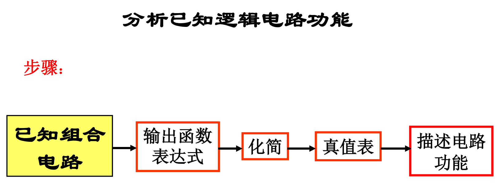
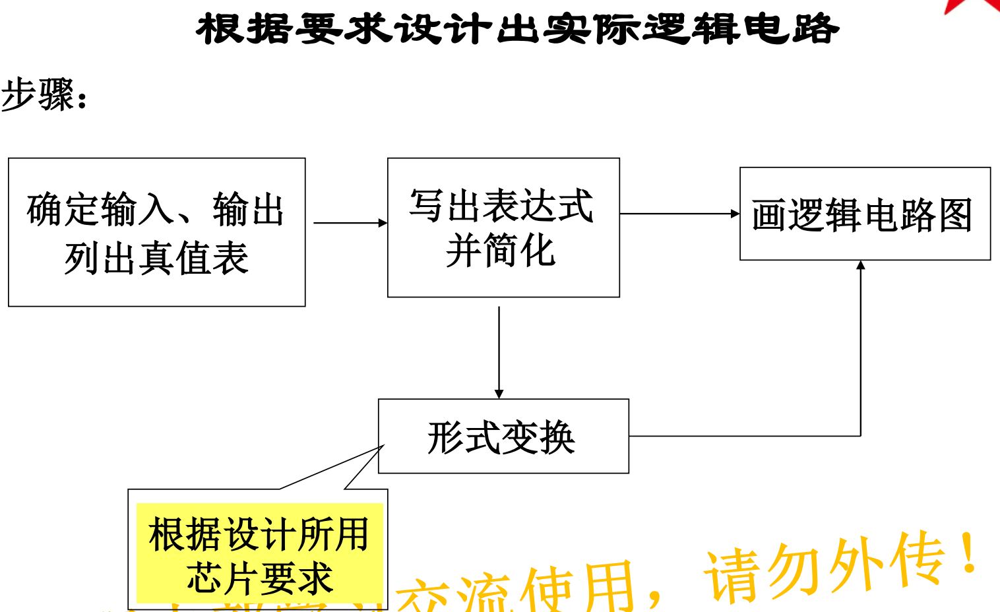
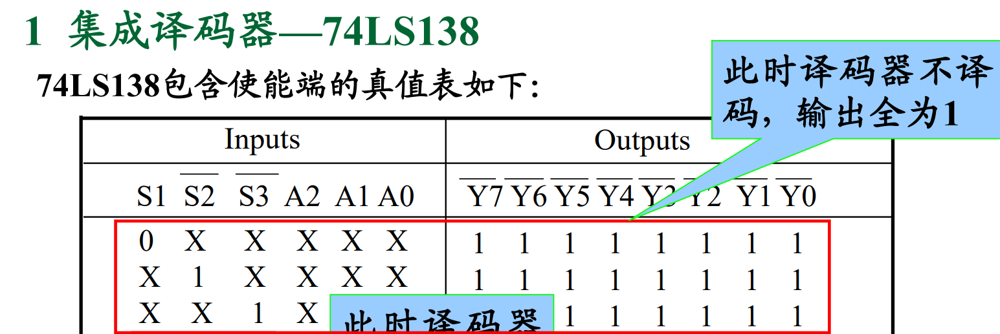
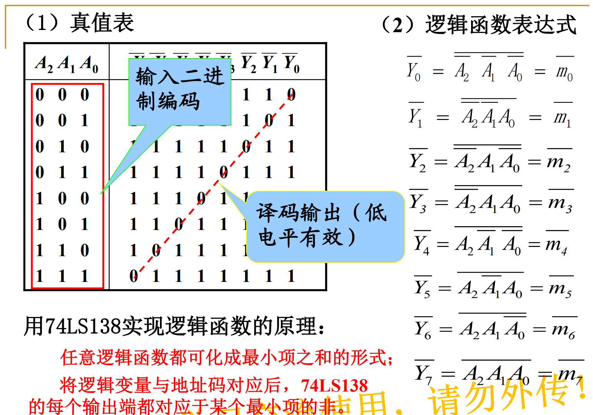
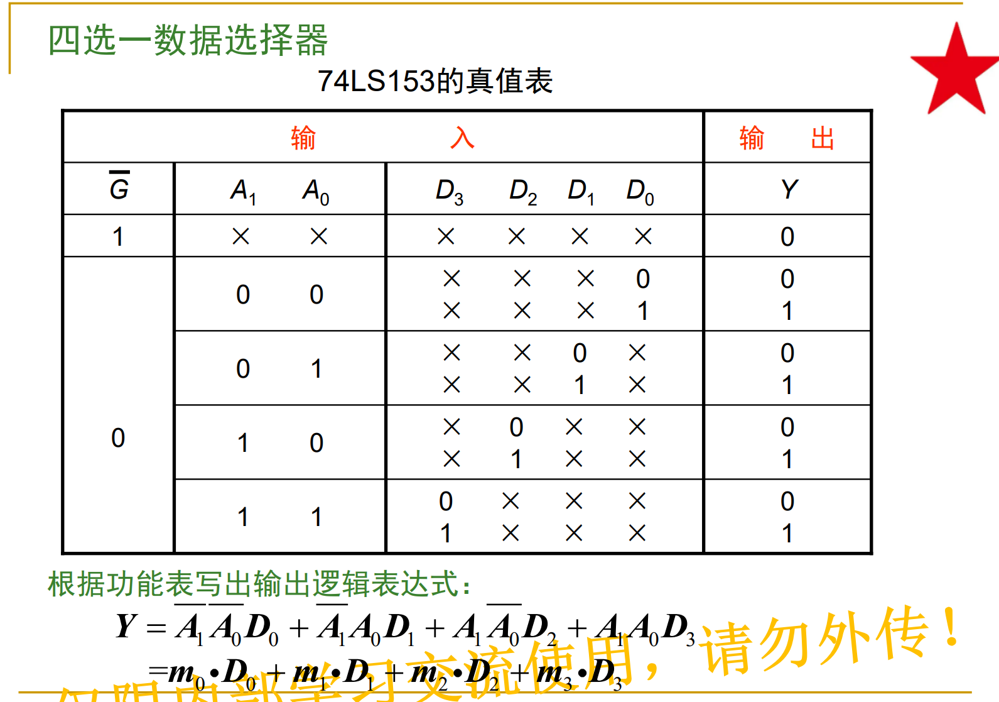
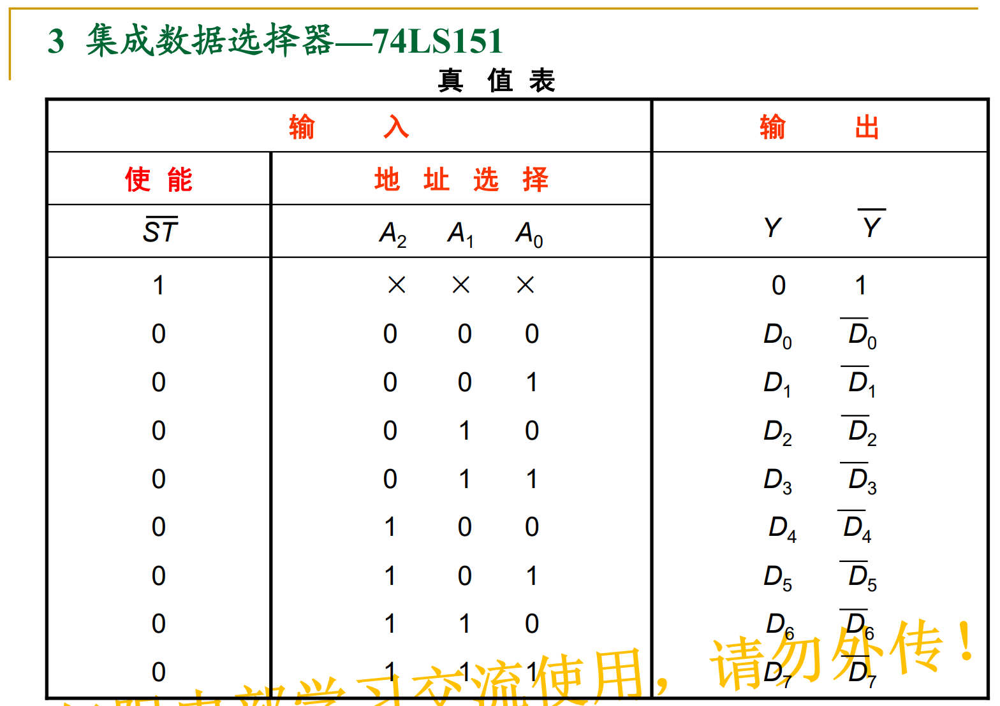

# 零 重点

<!--more-->

时序电路计数器

# 一 数制与编码（5）

8421 BCD码，简称8421码。按4位二 进制数的自然顺序， 取前十个数依次表示 十进制的0～9，后6个数不允许出现。

余三码：8421 码的基础上加 0011，范围 0011~1100。

# 二 逻辑代数基础（9）

## 与或非

## 反演规则

## 对偶规则

与反演相比，变量不反。

# 三 逻辑函数的化简（25）

## 公式法

就嗯化，实在不行用卡诺图找到答案，再反推

## 卡诺图化简

注意下标是格雷码

## 包含无关项的卡诺图化简

# 四 组合逻辑电路的分析（56）

1. 写出电路对应的逻辑函数表达式
2. 化简逻辑函数
3. 写出真值表
4. 描述电路功能

# 五 组合逻辑电路的设计（62）

1. 确定输入输出，列出真值表
2. 根据真值表写出逻辑函数并化简
3. 根据要求，变换成特定形式
4. 用**铅笔**画出逻辑电路图

## 半加、全加

半加：不考虑来自低位的进位的两个 1 位二进制数相加。 

全加：相加过程中既考虑加数、被加数，又考虑低位的进位

# 六 组合逻辑电路模块及其应用（74）

## 1 集成译码器—74LS138

先看使能端，只有当 $S_1=1,S_2=0,S_3=0$ 时译码器才能工作：

再看真值表，以及如何利用输出：

## 2 四选一数据选择器—74LS153

用四选一数据选择器 74LS153 实现逻辑函数，重点在于 $A_0,A_1$ 两个输入组成的极小项，以及各极小项的输出：
$$
\begin{align}
Y&=\overline{A}\overline{B}D_0+\overline{A}BD_1+A\overline{B}D_2+ABD_3 \newline
&=m_0D_0+m_1D_1+m_2D2+m_3D_3
\end{align}
$$

## 3 八选一数据选择器—74LS151

和 74LS153 差不多，不过是八选一：

# 七 锁存器与触发器（90）

# 八 时序逻辑电路的分析（107）

# 十 计数器（118）