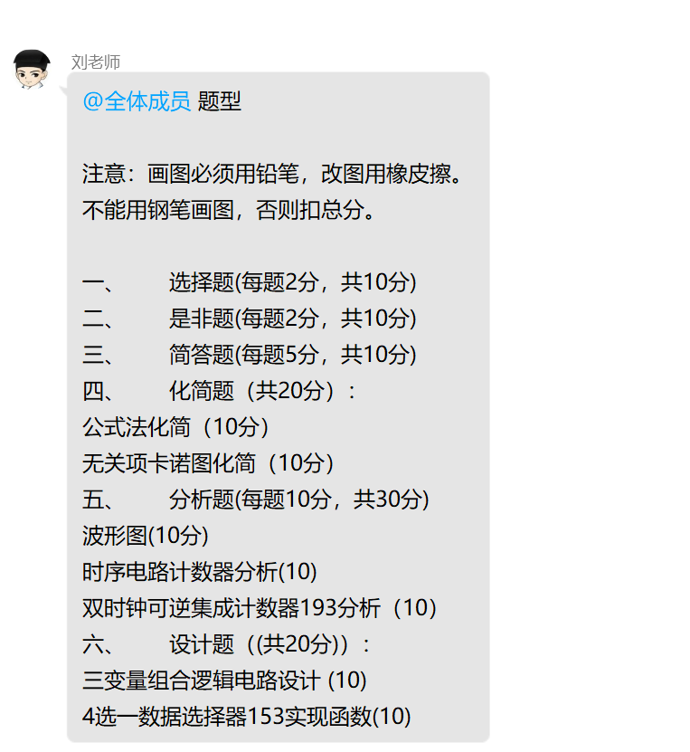
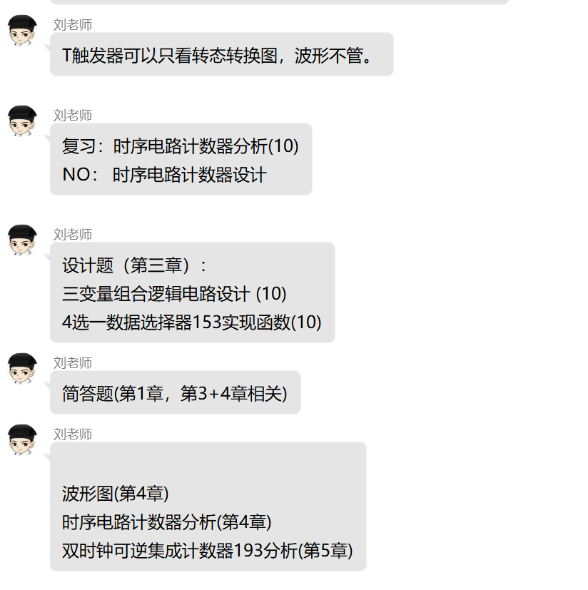
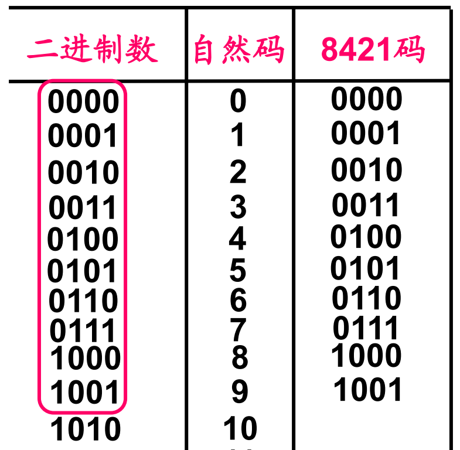
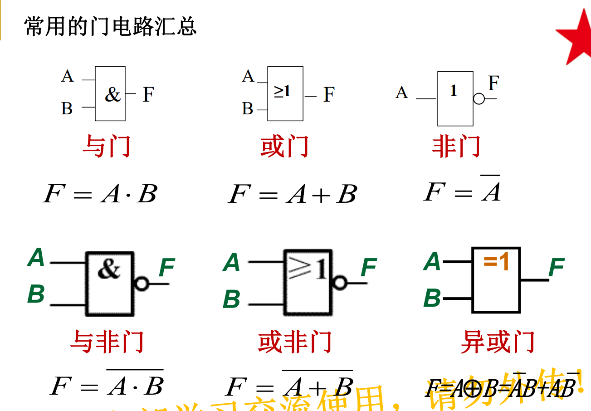
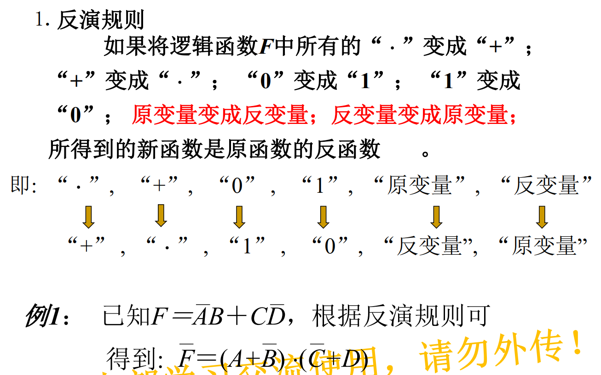
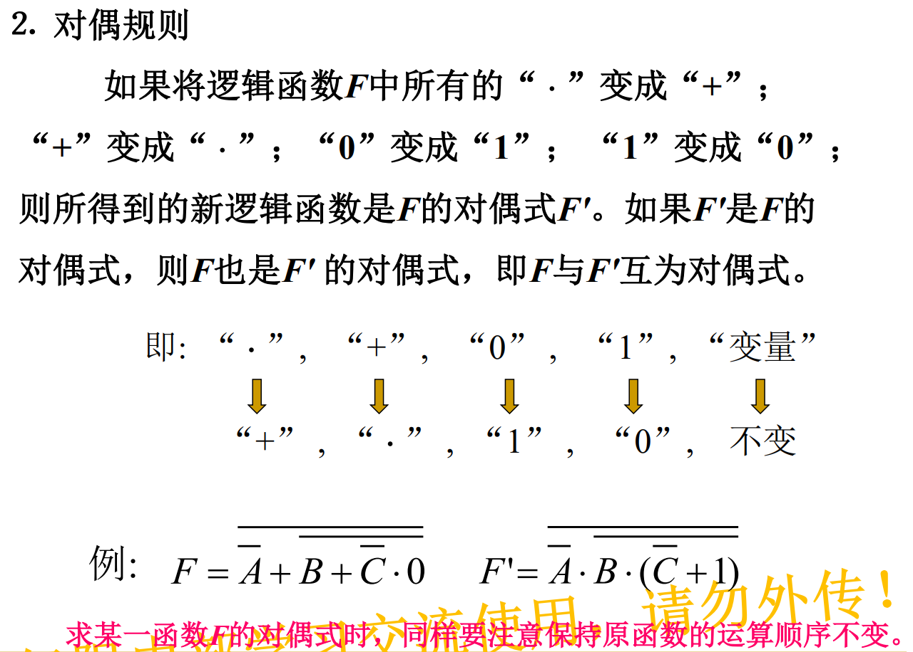
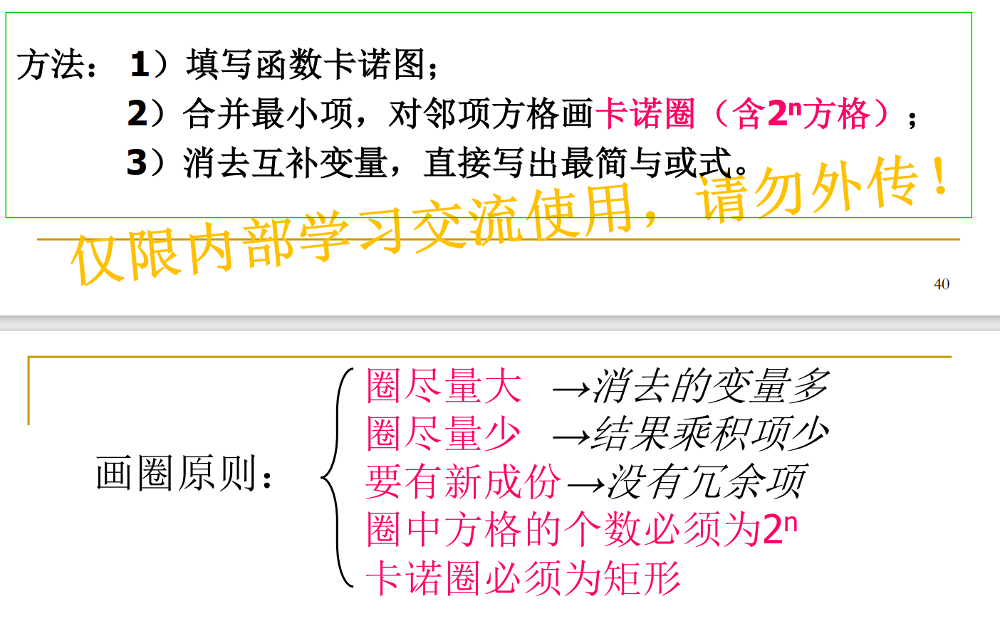
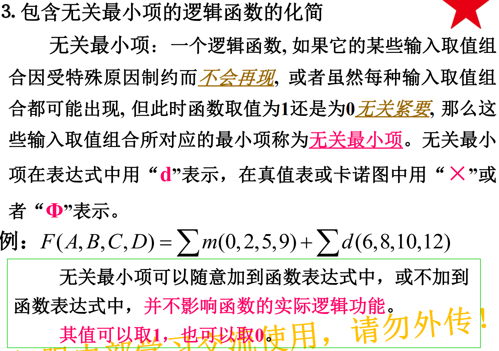

# 零 重点

# 一 数制与编码（5）

8421 BCD码，简称8421码。按4位二 进制数的自然顺序， 取前十个数依次表示 十进制的0～9，后6个数不允许出现。

余三码：8421 码的基础上加 0011，范围 0011~1100。

# 二 逻辑代数基础（9）

## 与或非

## 反演规则

## 对偶规则

与反演相比，变量不反。

# 三 逻辑函数的化简（25）

## 公式法

就嗯化，实在不行用卡诺图找到答案，再反推

## 卡诺图

注意下标是格雷码

## 包含无关项的卡诺图化简

# 四 组合逻辑电路的分析（56）

# 五 组合逻辑电路的设计（62）

# 六 组合逻辑电路模块及其应用（74）

# 七 锁存器与触发器（90）

# 八 时序逻辑电路的分析（107）

# 十 计数器（118）