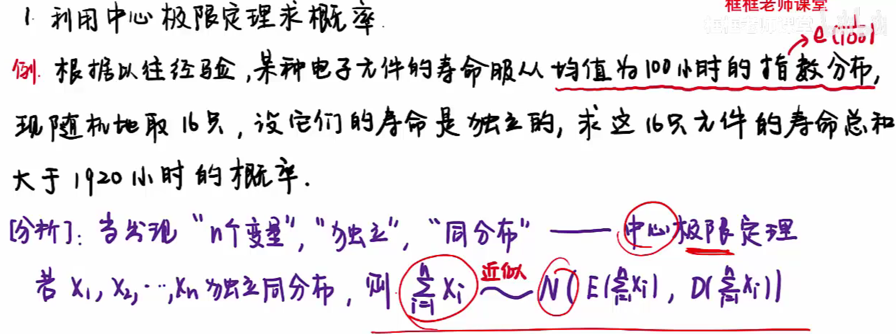
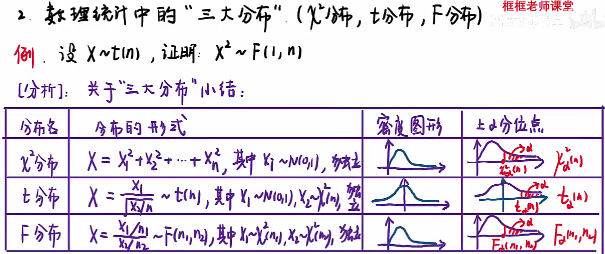

# 随机事件及其概率（一）

Addition: $P(A\cup b)=P(A)+P(B)-P(AB)$

Subtraction: $P(A-B)=P(A)-P(AB)$

Multiplication: $P(AB)=P(A|B)P(B)$

Division(Conditional Probability): $P(A|B)=\frac{P(AB)}{P(B)}$

Event $A$ and $B$ are independent equals to: $P(A)P(B)=P(AB)$

# 随机事件及其概率（二）

## Law of total probability

If $\left\{{B_{n}:n=1,2,3,\ldots }\right\}$ is a set of pairwise disjoint events whose union is the entire sample space and each $B_n$ is measurable, then for any event $A$ of the same sample space:
$$
P(A)=\sum_{n}P(A)P(B_n)
$$
or alternative:
$$
P(A)=\sum_{n}P(A|B_n)P(B_n)
$$

## Bayes' theorem

$$
P(A|B)=\frac{P(B|A)P(A)}{P(B)}
$$

It looks like Condition Probability formula, but we usually use it to find probability of condition $A$ if event $B$ happened.

## Binomial distribution

In general, if the random variable $X$ follows the binomial distribution with parameters $n\in \mathbb {N}$  and $p ∈ [0,1]$, we write $X \sim B(n, p)$. The probability of getting exactly $k$ successes in $n$ independent Bernoulli trials (with the same rate $p$) is given by the probability mass function:
$$
{\displaystyle f(k,n,p)=\Pr(k;n,p)=\Pr(X=k)={\binom {n}{k}}p^{k}(1-p)^{n-k}}
$$

# 一维随机变量及其分布（一）

Probability mass function.

离散：求分布律画表格，或者可能是二项分布。

连续：
$$
P(a\le X\le b)=F(b)-F(a)=\int_{a}^{b}f(x)
$$

The probabilities associated with all (hypothetical) values must be non-negative and sum up to 1,

$$
{\displaystyle \sum _{x}p_{X}(x)=1}
$$
and
$$
{\displaystyle p_{X}(x)\geq 0.}
$$

# 一维随机变量及其分布（二）

## Poisson distribution

A discrete random variable $X$ is said to have a Poisson distribution, with parameter ${\displaystyle \lambda >0,}$ if it has a probability mass function given by:
$$
{\displaystyle f(k;\lambda )=\Pr(X{=}k)={\frac {\lambda ^{k}e^{-\lambda }}{k!}},}
$$
where

$k$ is the number of occurrences (${\displaystyle k=0,1,2,\ldots }$)
$e$ is Euler's number ($e=2.71828\ldots $)
$k! = k(k–1) ··· (3)(2)(1)$ is the factorial.
The positive real number λ is equal to the expected value(期望) of X and also to its variance(方差).
$$
{\displaystyle \lambda =\operatorname {E} (X)=\operatorname {D} (X).}
$$

## Continuous uniform distribution

The probability density function of the continuous uniform distribution is:

$$
{\displaystyle f(x)={\begin{cases}{\frac {1}{b-a}}&{\text{for }}a\leq x\leq b,\\[8pt]0&{\text{for }}x<a\ {\text{ or }}\ x>b.\end{cases}}}
$$

$$
E(X)=b-a
$$

$$
D(X)=\frac{(b-a)^2}{12}
$$

## Exponential distribution

The probability density function (pdf) of an exponential distribution is

$$
{\displaystyle f(x;\lambda )={\begin{cases}\lambda e^{-\lambda x}&x\geq 0,\\0&x<0.\end{cases}}}
$$
Here $λ \gt 0$ is the parameter of the distribution, often called the rate parameter. The distribution is supported on the interval $[0, \infty)$. If a random variable $X$ has this distribution, we write $X \sim Exp(λ)$.

The mean or expected value of an exponentially distributed random variable $X$ with rate parameter $\lambda$ is given by

$$
{\displaystyle \operatorname {E} [X]={\frac {1}{\lambda }}.}
$$

The variance of $X$ is given by

$$
{\displaystyle \operatorname {D} [X]={\frac {1}{\lambda ^{2}}},}
$$

## Normal distribution

In statistics, a normal distribution or Gaussian distribution is a type of continuous probability distribution for a real-valued random variable. The general form of its probability density function is

$$
{\displaystyle f(x)={\frac {1}{\sigma {\sqrt {2\pi }}}}e^{-{\frac {1}{2}}\left({\frac {x-\mu }{\sigma }}\right)^{2}}}
$$
The parameter $\mu$  is the mean or expectation of the distribution (and also its median and mode), while the parameter $\sigma$  is its standard deviation. The variance of the distribution is $\sigma ^{2}$.

可加性：

## 定理

In some cases, giving probability density function $f_{X}(x)$, and $h(y)$, have probability density funciton:
$$
f_{Y}(y)={\begin{cases}
{f_{X}(h(y))|h'(y)|}&{\text{for }}\alpha\leq x\leq \beta,\\[8pt]0&{\text{otherwise }}
\end{cases}}
$$

# 二维随机变量及其分布

## 联合分布

$$
F(x,y)=\int_{-\infty}^{+\infty}\int_{-\infty}^{+\infty}f(x,y)\mathrm{d}x\mathrm{d}y
$$

## 边缘概率密度

$$
f_Y(y)=\int_{-\infty}^{+\infty}f(x,y)\mathrm{d}x
$$

$$
f_X(x)=\int_{-\infty}^{+\infty}f(x,y)\mathrm{d}y
$$

## 条件分布

$$
f_{X|Y}(x|y)=\frac{f(x,y)}{f_Y(y)}
$$

## 相互独立

$$
f_X(x)f_Y(y)=f(x,y)
$$

# 随机变量的数字特征

主要四个特征：

## 期望：

离散：
$$
E(X)=\sum_{n}X_nP_n
$$

连续：
$$
E(X)=\int_{-\infty}^{+\infty}xf(x)\mathrm{d}x
$$
性质：
$$
E(X+Y)=E(X)+E(Y)
$$

## 方差：

$$
D(X)=E(X-E(X))=E(X^2)-E(X)^2
$$

$$
D(CX)=C^2D(X)
$$

$$
D(X+C)=D(X)
$$

$$
D(X+Y)=D(X)+D(Y)+2Cov(X,Y)
$$

相互独立：
$$
D(X+Y)=D(X)+D(Y)
$$

## 协方差：

$$
Cov(X,Y)=E\{[X-E(X)][Y-E(Y)]\}=E(XY)-E(X)(Y)
$$

随机变量相同：
$$
Cov(X,X)=D(X)
$$
交换：
$$
Cov(X,Y)=Cov(Y,X)
$$
分配：
$$
Cov(X+Y,Z)=Cov(X,Z)+Cov(Y,Z)
$$

独立是协方差为 0 的充分不必要条件.

## 相关系数：

$$
P_{XY}=\frac{Cov(X,Y)}{\sqrt{D(X)D(Y)}}
$$

独立是相关系数为 0 的充分不必要条件.

## 切比雪夫不等式

For random variables $X$ that $E(X)=\mu$ and $D(X)=\sigma^2$, have any $\epsilon$:
$$
P(|X-\mu|\ge \epsilon)\le\frac{\sigma^2}{\epsilon^2}
$$
or alternative:
$$
P(|X-\mu|\lt \epsilon)\le 1-\frac{\sigma^2}{\epsilon^2}
$$

# 中心极限定理与数理统计基本概念

## 利用中心极限定理求概率

或者：
$$
\frac{\sum_{i=1}^{n}X_i-\mu}{\sigma^2}\sim\Phi(x)
$$

## 数理统计中的三大分布

分别是：$\chi^2$ 分布，$t$ 分布，$F$ 分布

# 参数估计

求估计量就是随机变量 $X$，求估计值就是观测值 $x$.

## 点估计：矩估计和最大似然估计

注意最大似然估计求导是对 $\theta$ 求导。

## 估计量的无偏性与有效性

## 区间估计

# 假设检验

假设检验就是检验：是否正常、是否符合、是否达到要求之类。

求 $\mu$ 带 $\mu$，求 $\sigma^2$ 带 $\sigma^2$。

## 正态总体下均值 $\mu$ 的假设检验（$U$ 检验，$T$ 检验）

这里是给出了现实的均值，要比对理论上分布的均值 $\mu$ 是否与之匹配。

求均值 $\mu$，方差 $\sigma^2$ 已知：
$$
\frac{\overline{X}-\mu}{\sigma/\sqrt{n}}\sim N(0,1)
$$
求均值 $\mu$，方差 $\sigma^2$ 未知（注意右边 $n-1$）：
$$
\frac{\overline{X}-\mu}{s/\sqrt{n}}\sim t(n-1)
$$
其中 $s$ 是标准差。

做题的时候先求拒绝域，再把数据带入枢轴量与其比对。

## 正态总体方差 $\sigma^2$ 的假设检验（$\chi^2$ 检验）

这里给出了要求的方差 $\sigma_0^2$，要比对分布的方差是否与之匹配（注意两边 $n-1$，而且左边的在分子，分子还有 $s^2$；分母是 $\sigma_2$）：
$$
\frac{(n-1)s^2}{\sigma^2}\sim \chi^2(n-1)
$$
其中 $s$ 是标准差。

做题的时候先求拒绝域，再把数据带入枢轴量与其比对。

