# 计算机网络概述

## 计算机网络

定义：计算机网络主要是由一些**通用的、可编程的硬件**互连而成的，而这些硬件并非专门用来实现某一特定目的（例如，传送数据或视频信号）。这些可编程的硬件能够用来传送**多种不同类型的数据**，并能支持广泛的和日益增长的应用。

可以分为**边缘部分（资源子网）**和**核心部分（通信子网）**。

<!--more-->

## 性能指标

速率：数据的**传输速率**，单位比特每秒，b/s，bps，kb/s，Mb/s。

带宽：网络的**通信线路**所能传送数据的能力，单位为比特每秒。

吞吐量：单位时间通过一个网络（接口）的数据量。

时延：

- 发送时延：发送过程中，从发出分组中第一个比特到发完最后一个比特所需的时间；
- 传播时延：一个比特从链路一端到另一端的时间；
- 处理时延：分析、检验等花费的时间；
- 排队时延：进入路由器后等待处理的时间：

时延相关：

- 时延带宽积=传播时延×带宽；
- 往返时间（RTT）：**发送方**开始发送数据，到**发送方**收到来自接收方的确认为止，总共经历的时间。

利用率：信道或网络被利用的时间的比率。
$$
D=\frac{D_0}{1-U}
$$
其中：

- $D$ 是网络当前时延
- $D_0$ 是网络空闲时的时延
- $U$ 是网络当前的利用率。

## 网络体系结构

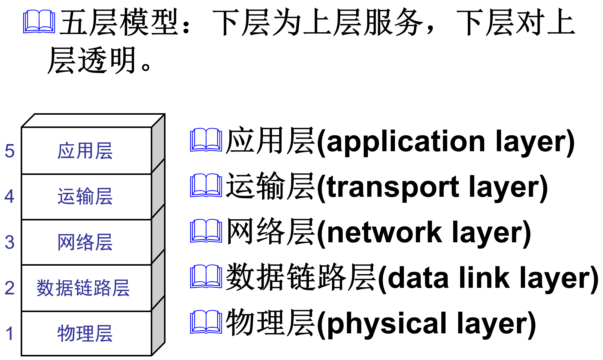

协议，为网络中的数据交换而建立的规则、标准或约定，包含三个要素：

- 语义：规定了传输数据的格式（比特流、分片等）；
- 语法：规定了所要完成的功能；
- 同步：规定了各种操作的时序关系。

接口：相邻两层交换信息的节点。

服务：下层为紧邻的上层提供的调用功能。

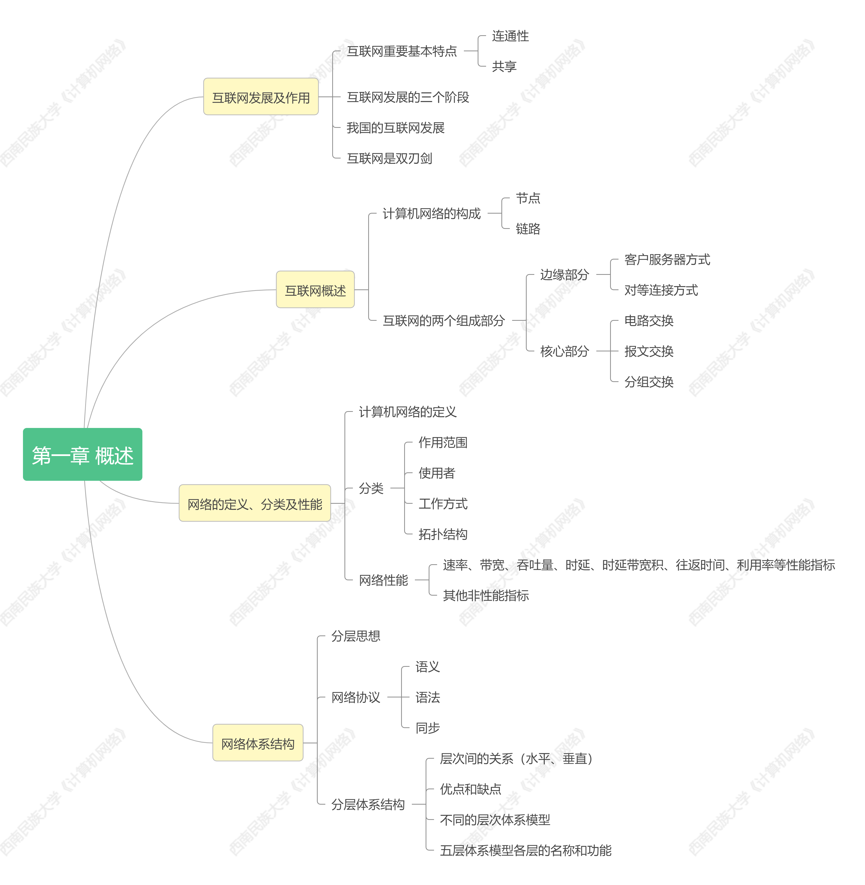

# 物理层

## 通信基础

信源：产生和发送数据的源头。

信道，信号的传输媒介，分为一下三种：

- 单工通道：只有一个方向的通信；
- 半双工通道：可以双向通信，但同一时刻只能一方发送另一方接受；
- 全双工通道：可以同时双向通信。

信宿：接受数据的终点。

## 奈氏准则

不考虑噪声影响，码元的最高传输速率是 
$$
2W\log_2 V
$$
单位是码元/秒，这里 $W$ 是带宽，$V$ 可以理解为物理状态表示数据的方法量。

## 香农定理

在奈氏准则的基础上，考虑噪声干扰，信道的极限信息传输速率为：
$$
W\log_2(1+S/N)
$$
这里 $S/N$ 是信噪比，单位为分贝。

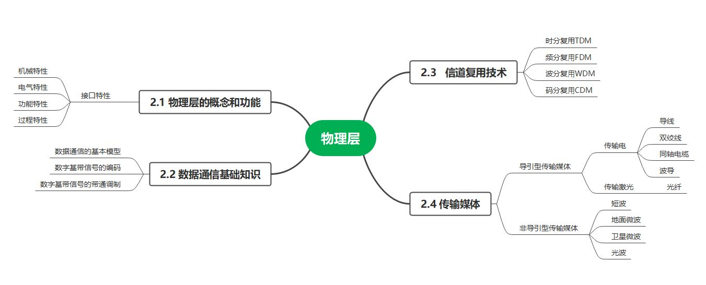

## 编码

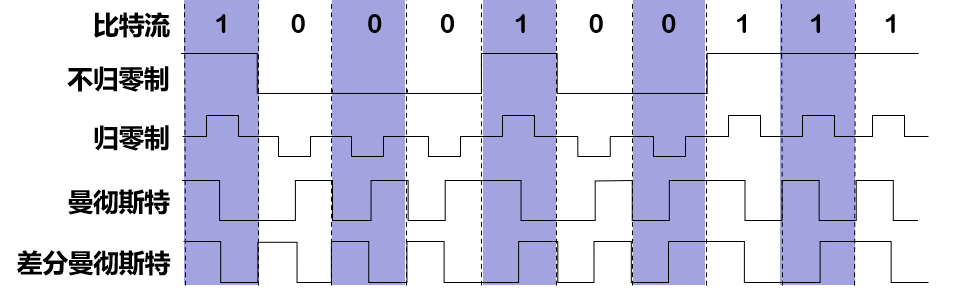

- 不归零制：正电平为 1，负电平为 0；
- 归零制：正脉冲为 1，负脉冲为 0；
- 曼彻斯特：位周期中心向上跳变为 0，向下跳变为 1（也可以反过来定义）；
- 差分曼彻斯特：位中心总是跳变。位开始边界跳变为 0，不跳变为 1；

## 基本的带通调制方法

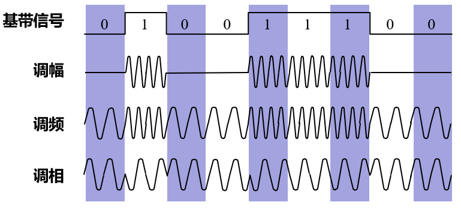

## 分组交换

建立连接太非资源；

报文交换难以统一；

所以，分组交换，存储转发：

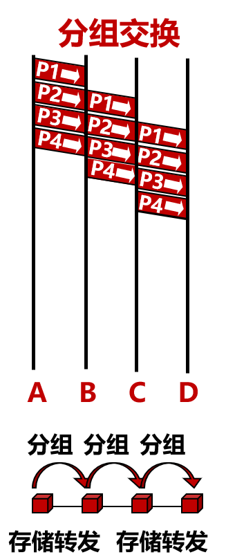

优点：减少出错概率和重发数据量；

缺点：需要传输额外的信息量，可能失序、丢失或重复。

# 数据链路层

主要功能：

- 封装成帧：帧是**数据链路层的基本传输单位**，包含数据和控制信息；
- 透明传输：不管所传数据是什么样的比特组合，都应当能够在相邻节点之间传送，但不对数据进行处理和分段、重组等操作；
- 差错控制。

## 封装成帧

最大传输单元（**M**aximum **T**ransmission **U**nit，缩写 **MTU**），是指数据链路层上面所能通过的最大数据包大小（以字节为单位），以太网协议规定为 1500 字节，不包含 14 字节的帧头和 4 字节的帧尾（所以帧长最大为 1518）。

## 透明传输

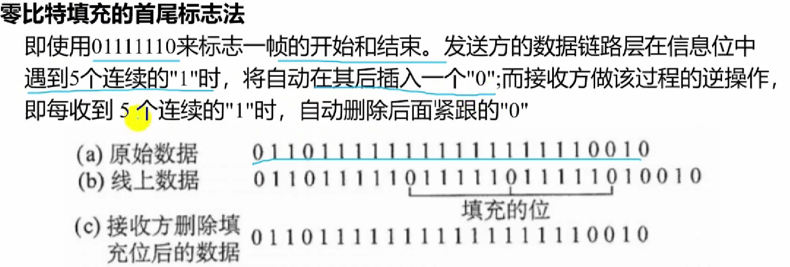

## 差错控制

CRC 循环冗余校验：

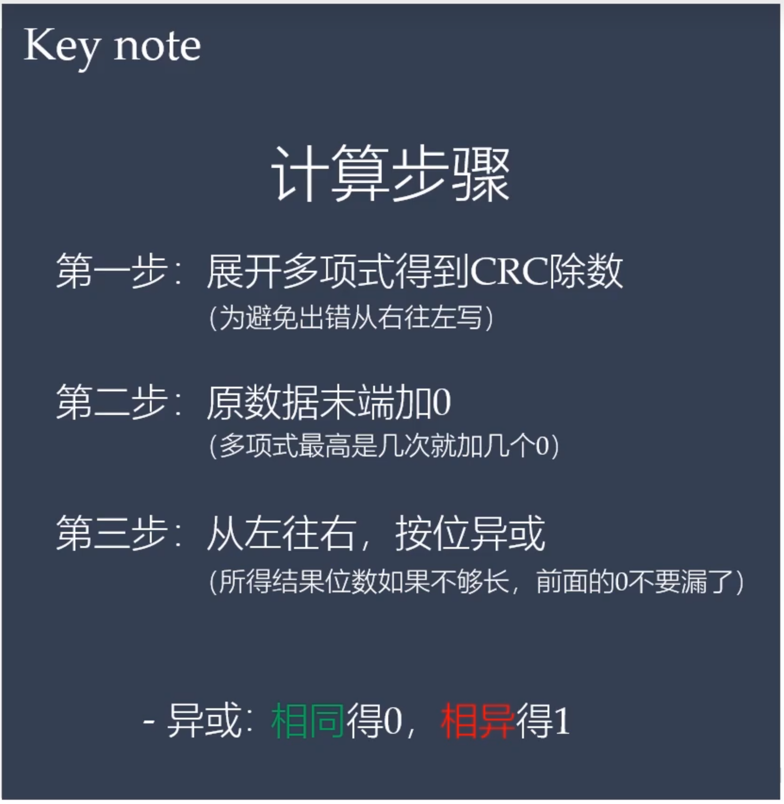

## CSMA/CD 协议

**载波侦听多路访问／碰撞检测**（Carrier Sense Multiple Access with Collision Detection）：

- 先听后发；
- 边听边发；
- 冲突停发；
- 延迟重发。

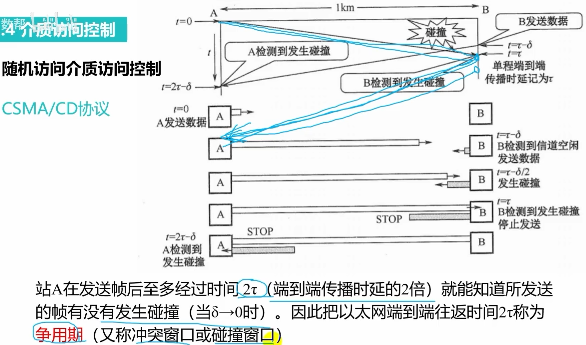

CDMA/CD 算法限制最短的帧长为 64 字节，除去帧头 14 字节和帧尾 4 字节，数据部分最短 46 字节，即
$$
14+MUT+4\in[64,1518]
$$

## 网桥

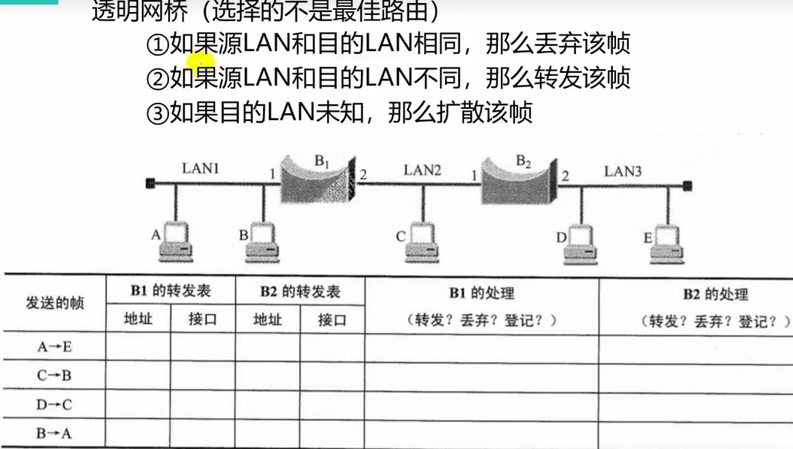

## 交换机

网络接口层（物理层+数据链路层）

采用存储转发的方式工作

交换机端口隔离冲突域

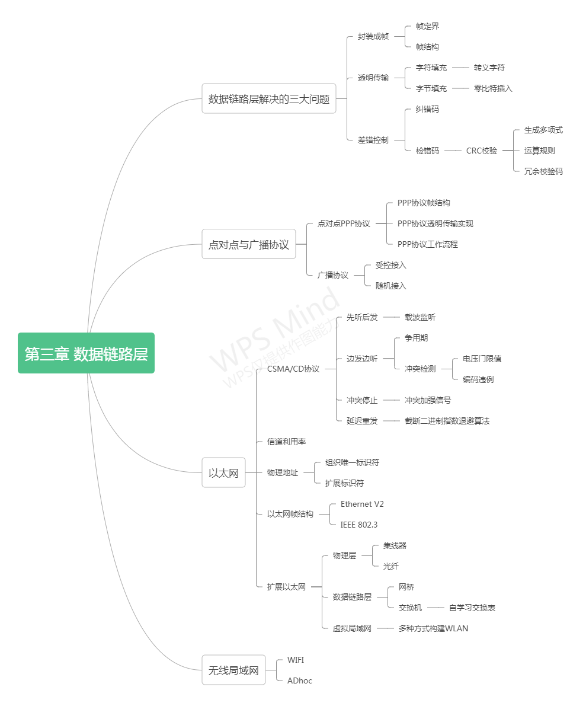

# 网络层

网络提供不可靠的、尽最大努力的服务。

路由器根据转发表寻找目的地。

## 地址解析协议 ARP

通常情况下主机中的ARP缓存表由主机自动建立，可动态变化。

## 分类的 IP 地址

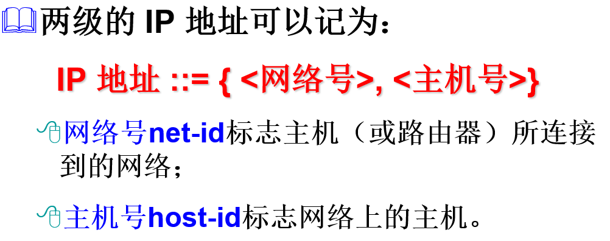

## 无分类编织 CIDR

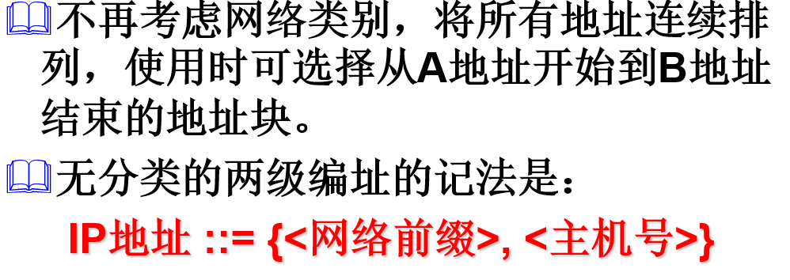

## 掩码

可以用点分十进制表示，也可以简单的表示为“IP地址/x”。 “/”后的值表示掩码中二进制高位连续为 1 的位数，即当前网络前缀占多少个二进制位。

## RIP 协议

- 要求网络中的每个路由器都要维护从它自己到其他每一个目的网络的距离记录。最大距离 15 跳。
- 仅和相邻路由器交换信息，按固定时间间隔交换路由信息。
- 交换的信息是当前本路由器所知道的全部信息，即自己的路由表。

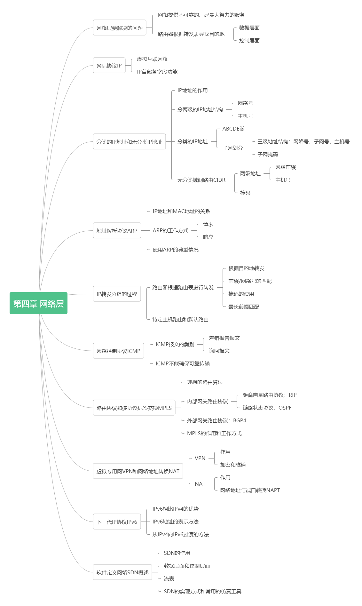

# 运输层

## TCP 可靠性

- 报头中的校验字段
- 可靠传输：确认和重传机制（超时计时器）
- 流量和拥塞控制：通过滑动窗口实现（窗口的变化，缓存机制）
- 面向连接：连接的建立（三握手）和释放（四挥手）

## TCP 流量控制

点对点。

TCP 通过滑动窗口实现流量控制。流量控制就是让发送方的发送速率不要太快，既要让接收方来得及接收，也不要使网络发生拥塞。

## TCP 拥塞控制

整个网络。

防止过多数据注入网络。

- 慢开始和拥塞避免
- 快重传和快恢复

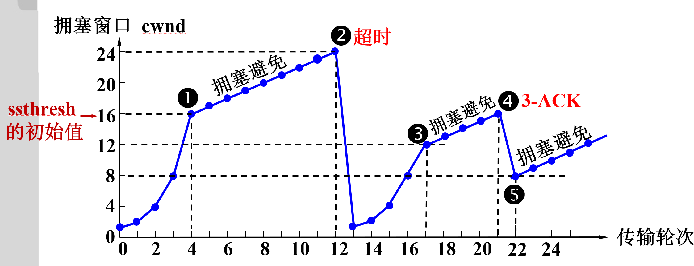

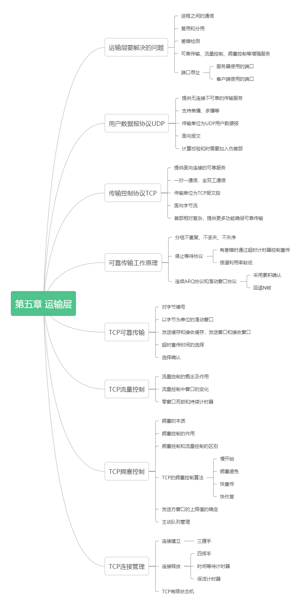

# 应用层

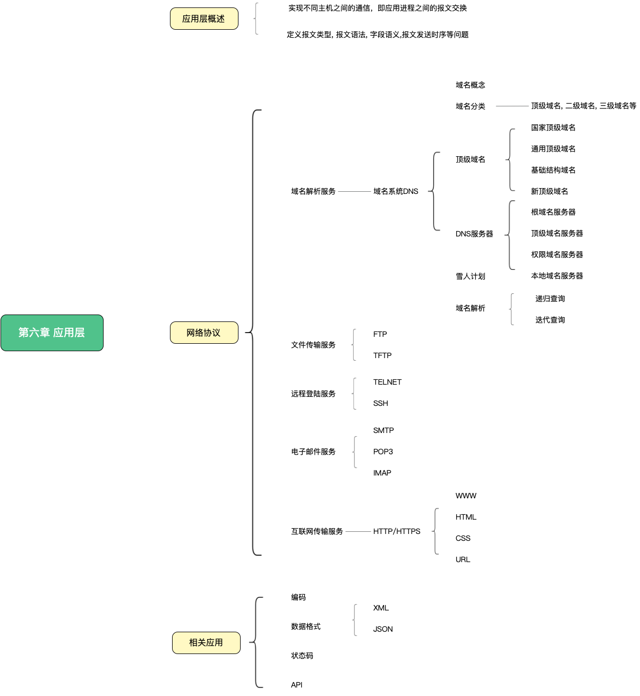