# 第1章:

P8  P12冯诺依曼计算机中指令和数据是以二进制形式存储在计算机中的，CPU 区分他们的依据是指令周期的不同阶段。

p16 计算机硬件的主要指标。

- 机器字长
- 存储容量
- 运算速度

<!--more-->

2、计算机硬件技术指标:机器字长、存储容量等等，参见练习题17，1.8 1.11 .

指令和数据都存于存储器中，计算机如何区分它们？CPU 依据不同的指令周期（取指周期，执行周期）区分

3、什么是操作码

操作码指计算机程序中所规定的要执行操作的那一部分指令或字段(通常用代码表示)

# 第3章系统总线

## 总线定义及分类

P43、什么是总线，总线分类

总线是构成计算机系统的**互联机构**，是多个**系统功能部件**之间进行**数据传送**的公共通路。  

总线分类，地址线、数据线和控制线的功能：

- 片内总线：芯片内通信
- 系统总线：五大部件间的信息传输线
  - 数据总线：传输数据
  - 地址总线：传输地址
  - 控制总线：发出控制信号
- 通信总线：计算机与其他计算机（系统）间通信

## 总线复用

总线复用：一条信号线上**分时**传送两种信号。例如，通常地址总线与数据总线在物理上
是分开的两种总线，地址总线传输地址码，数据总线传输数据信息。为了提高总线的利用率，优
化设计，特将地址总线和数据总线共用一组物理线路，在这组物理线路上分时传输地址信号和数
据信号，即为总线的多路复用。

## 总线判优控制

P57 总线控制 ，主要解决的问题:3.5.1、3.5.2

总线判优控制，集中式仲裁中的速度优劣问题。

（1）链式查询

有 3 根控制总线用于总线控制（BS 总线忙、BR 总线请求、BG 总线同意） 总线同意信号 BG 是串行地从一个 I/O 接口送到下一个 I/O 接口。（离总线控制 部件最近的设备具有最高的优先级） 

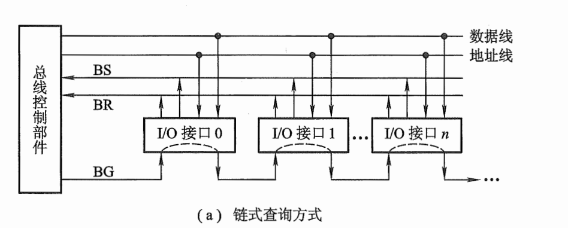

（2）计数器定时查询

比链式查询多了一组设备地址线，少了一根总线同意先 BG。 特点： ①计数从“0”开始，一旦设备的优先次序被固定，设备的优先级就按 0、1、2、… 的顺序降序排列，固定不变。 ②计数从上一次计数的终止点开始，即使一种循环方法，此时设备使用总线的优 先级相等。 ③初始值可由程序设置，优先次序可以改变。

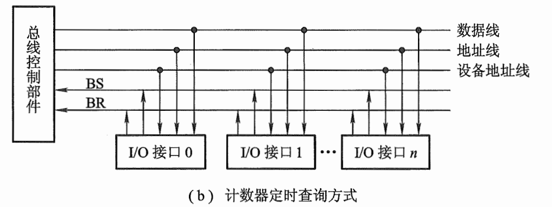

（3）独立请求方式

每一台设备均有一对总线请求先 BRi 和总线同一线 BGi。 总线控制部件中有个排队电路，可根据优先次序确定哪一台设备的请求。

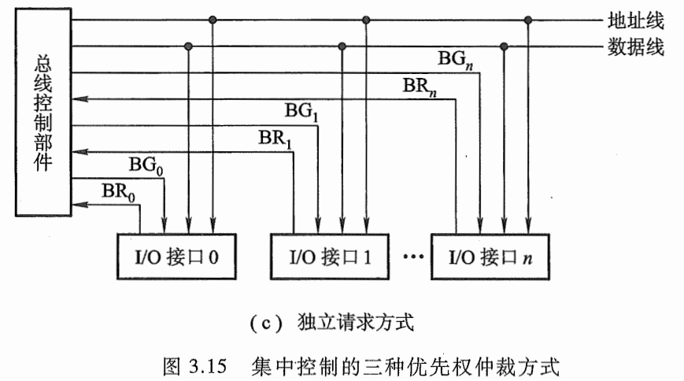

速度和灵活性递增，线路越来越复杂。

## 同步异步

P59 同步通讯， 异步通讯。

- 同步：通信双方由统一时标控制数据传
- 异步：没有公共的时钟标准，不要求所有部件严格的统一操作 时间，采用应答方式（又称握手方式）

# 第4章 存储器

## 存储器的分类和各自的性能速度

- 缓存
- 主存
  - RAM
  - ROM
- 辅存

## 地址分配、技术指标、线路复用

P73 主存储单元的地址分配、主存的技术指标。线路的复用，哪两根线复用?

地址分配：按字节、按字编址

技术指标：

- 存储容量
- 存取速度
- 存储期带块

## 存储期容量与地址、数据线

P75 64K*8 位的芯片的线路数量。 地址线为 2的16次方,共 16 根，数据线8根。根据容量求线的根数。

## 存储期与 CPU 的连接

P91 存储器与 CPU 的连接,

P94 例题 4.1 不要求画图,。

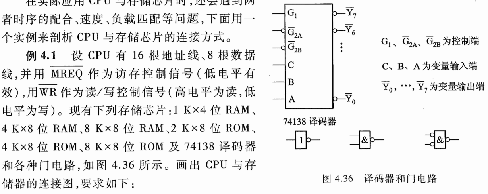

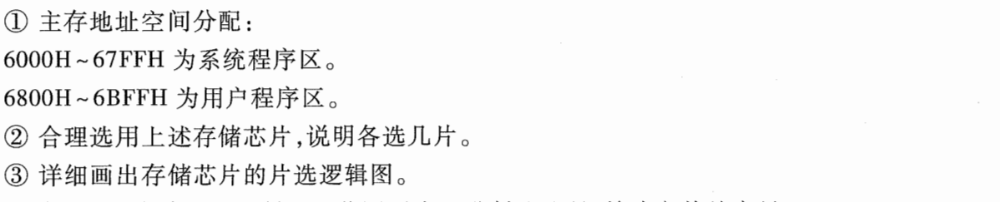

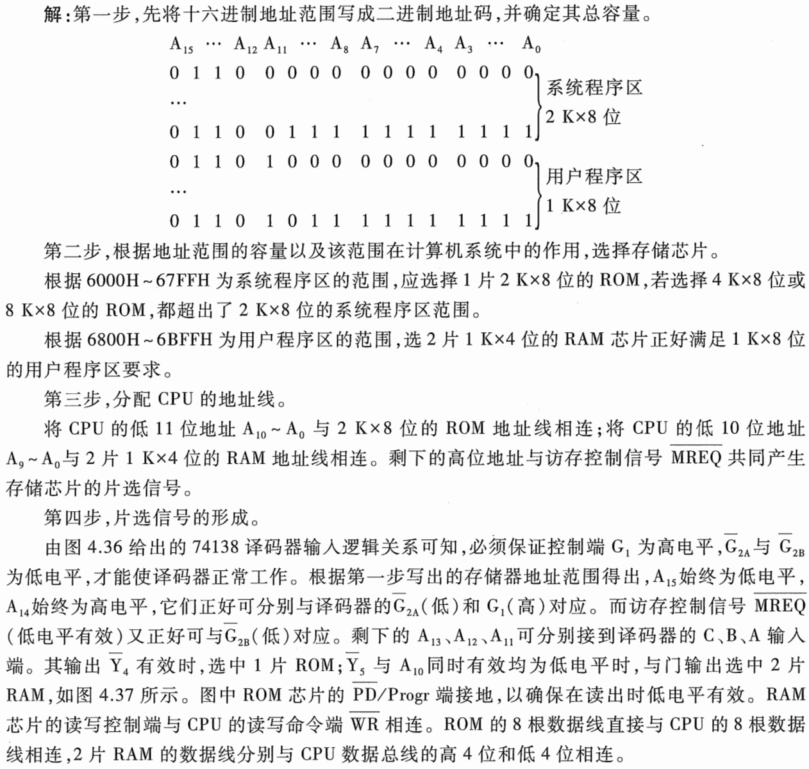

## Cache 组相联

P110-111 缓存的作用和工作原理，命中率的计算，例题 4.7.

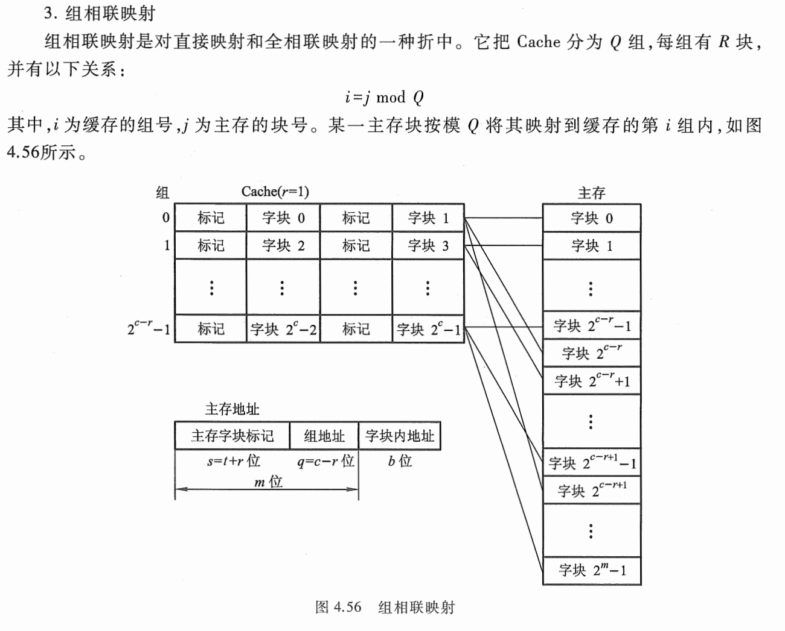

p120 三种地址映射的方式，重点第三种:组相连映射，例4.8 、4.9画出地址格式，确定缓存块数等等。地址映射由什么完成?

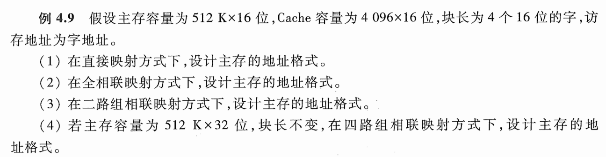

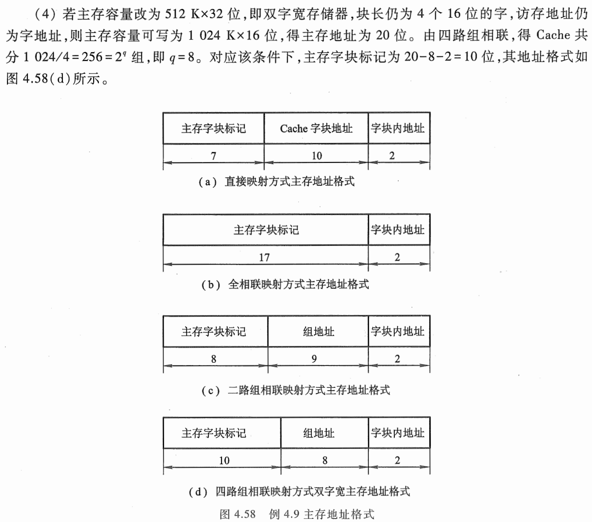

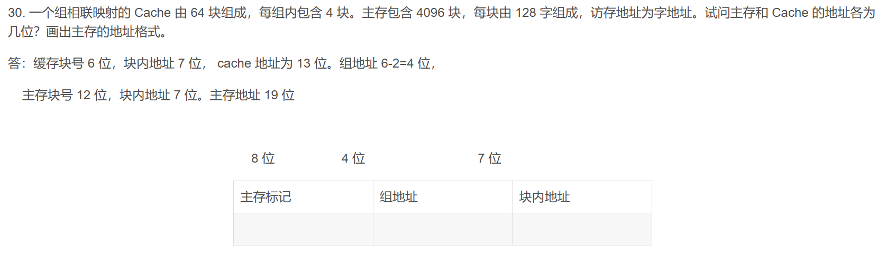

## Cache 透明

特别需指出的是，Cache 对用户是透明的，即用户编程时所用到的地址是主存地址，用户根本不知道这些主存块是否已调入 Cache 内。因为，将主存块调入 Cache 的任务全由机器硬件自动完成

# 第5章 I/O 系统

## I/O 编址方式

1、p159  I/O的编址方式(统一和不统一编址),以及之间的区别。

- 统一编址就是将 I/0 地址看作存储器地址的一部分。例如，在 64 地址的存储空间中，划 8K 地址作为 I/0 设备的地址，凡是在这 8K 地址范围内的访问，就是对 I/0 设备的访问，所用的指令与访存指令相似。
- 不统一编址就是指 I/0 地址和存储器地址是分开的，所有对 I/0 备的访问必须有专用的 I/0 指令。
- 区别：显然统一编址占用了存储空间，减少了主存容量，但无须专用 I/0 指令。不统一编址由千不占用主存空间，故不影响主存容量，但需设 I/0 专用指令。

## 中断

p192 什么是中断? 

计算机在执行程序的过程中，当出现异常情况或特殊请求时，计算机停止现行程序的运行， 转向对这些异常情况或特殊请求的处理，处理结束后再返回到现行程序的间断处，继续执行原程，这就是“中断＂

p198 中断服务程序的流程。

1. 保护现场
2. 设备服务
3. 恢复现场
4. 中断返回

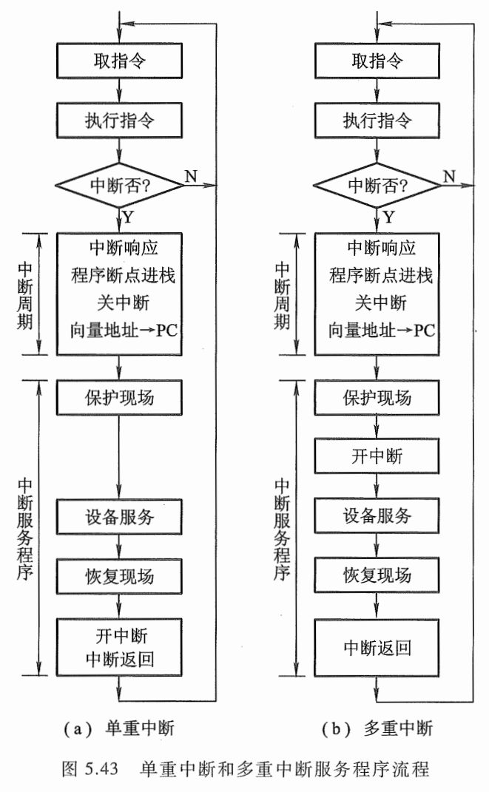

## DMA

2、P205 什么是 DMA，DMA 原理。DMA 中 CPU 与设备，传送与主进程串行还是并行

Direct Memory Access，在DMA 方式中，主存与 I/0 设备之间有一条数据通路，主存与 I/0 设备交换信息时，无须调用中断服务程序。并行。

## I/0 与主机交换信息的三种控制方式

3、I/0 与主机交换信息的三种控制方式

- 程序查询方式：程序查询方式是由 CPU 通过程序不断查询 I/0 设备是否己做好准备，从而控制 I/0 设备与 主机交换信息；
- 程序中断方式：倘若 CPU 在启动 I/0 设备后，不查询设备是否已准 备就绪，继续执行自身程序，只是当 I/0 设备准备就绪并 CPU 发出中断请求后才予以响应，这将大大提高 CPU 的工作效率；
- DMA 方式：DMA 方式中，主存与 I/0 设备之间有一条数据通路，主存与 I/0 设备交换信息时，无须调用中断服务程序。

案例:

机器字长为 64 位，存储容量为 128MB，若按字编址，它的寻址范围是。

由于字长为 64 位 那么 寻址范围是 2的 30 次方/64=2的 24 次方=2的 24 次方=16M

## 中断向量、中断地址、中断服务程序入口地址

中断向量、中断地址、中断服务程序入口地址、主程序的断点地址等概念。中断接口电路与 CPU 传输向量地址:

DMA 的概念、原理和特点。

CPU 一旦响应了 I/0 中断，就要暂停现行程序，转去执行该设备的中断服务程序。不同的设备有不同的中断服务程序，每个服务程序都有一个入口地址， CPU 必须找到这个入口地址。入口地址的寻找也可用硬件或软件的方法来完成，这里只介绍硬件向量法。所谓硬件向量法，就是通过向量地址来寻找设备的中断服务程序入口地址，而且向量地址是由硬件电路产生 的，

什么情况会触发中断请求?

- 硬件事件
- 软件事件
- 异常情况
- 定时任务

# 第6章 计算机运算方法

计算部件 ALU 的概念。

Arithmetic Logic Unit，算数逻辑单元，用来完成算数逻辑运算。

## 原码、反码、补码、移码

原码、反码、补码、移码的概念，表示数据表示地址，分别采用哪些形式?定点数和浮点数的表示方法，其表示范围和精度如何决定的。

- 原码：正数符号位为 0，负数符号位为 1；
- 反码：正数与原码相同，负数按位取反；
- 补码：正数与原码相同，负数按位取反后加 1；
- 移码：在原码的基础上加上偏移量。

**数据表示**：根据数据类型不同，可以使用无符号整数、有符号整数、浮点数、字符、字符串等形式。

**地址表示**：通常使用无符号整数形式，根据计算机架构不同，可能是32位或64位，某些体系结构下也可能使用段地址。

## 进制转换、浮点数

二进制十进制 16 进制之间的转换，包括整数分数和小数，

定点与浮点，溢出的判断和处理。

给出字长、容量、寻址范围，的部分条件求其他条件。

将十进制写为浮点数的计算步骤

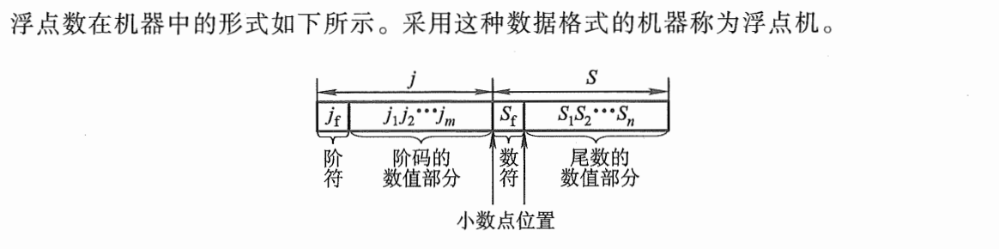

浮点数由阶码 $j$ 和尾数 $S$ 两部分组成。阶码是整数，阶符和阶码的位数 $m$ 合起来反映浮点 数的表示范围及小数点的实际位置；尾数是小数，其位数 $n$ 反映了浮点数的精度；尾数的符号 $S_f$ 代表浮点数的正负。

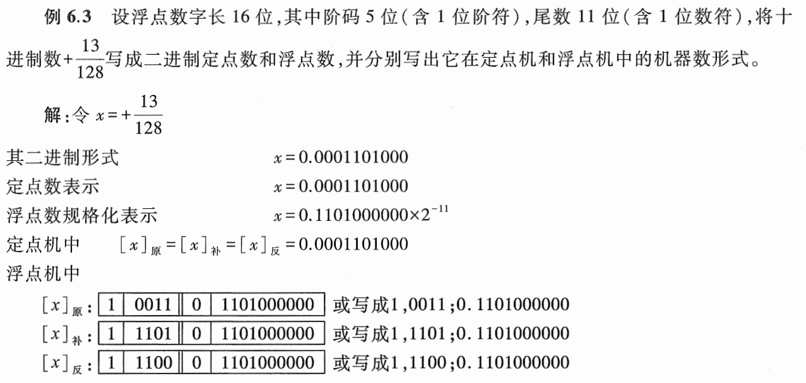

1、原码、(变形)补码、反码、移码的基本概念，以及相互转换。包括特殊的[y]补与[-y]补的转换规则。

P228 数的定点表示与浮点表示。

P237 定点加减法运算 与 溢出判断。

原码一位乘法(Booth 算法)移位次数，如n=20,需要移位多少次，计算多少次加法。

浮点数的加减法运算，对阶、规格化、溢出判断(两种方法)

Ppt 的一个例子，给定一个 10 进制数的范围和寄存器的长度，根据条件来判断解码和尾数应该如何来分配，。

2、P269 浮点加减运算。对阶，浮占数的规格化判断

1. 对阶
2. 尾数求和
3. 规格化

# 第7章 指令系统

一地址--多地址的指令格式。

## 数据寻址方式

P315 立即寻址、直接寻址、基址寻址、变址寻址，地址形成的原理，效率对比

- 基址寻址：操作数地址由基址寄存器的值和指令中的偏移量相加得到，基址不变，指令字 A 改变，用于为程序或数据分配空间；
- 变址寻址：操作数地址由变址寄存器的值和指令中的基址相加得到，指令字 A 不变，变址值改变，用于处理数组；
- 相对寻址：操作数地址是指令地址 PC 和指令中包含的偏移量相加得到，用于转移类指令。

CPU 的寄存器的分类和特点，哪些是用户可操作，哪些是用户不可操作的。

p302 地址码及其不同形式。

p307 不同类型的操作。

p310 寻址方式 P318 例 7.2.

指令基本结构，cache 访间命中率，

P335 课后练习7.16

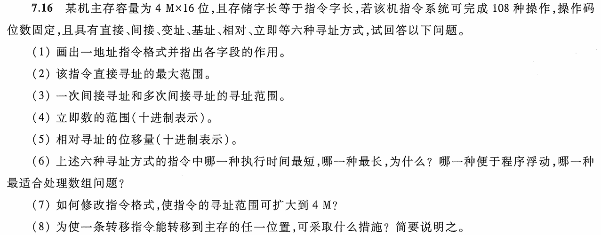

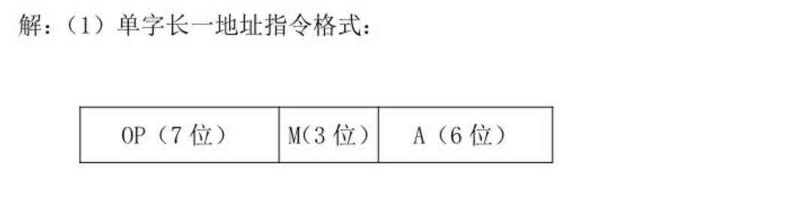

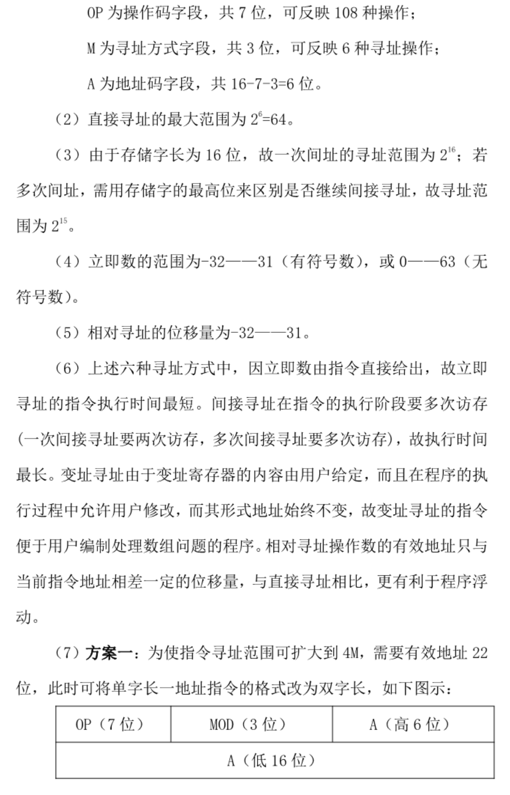

# 第8章 CPU

## 可见的寄存器、不可见寄存器

用户可见寄存器：

1. 通用寄存器
2. 数据寄存器
3. 地址寄存器
4. 条件码寄存器
5. PC

控制和状态寄存器：

1. MAR
2. MDR
3. PC
4. IR

1、P339  MAR  MDR PC  IR

## 流水线三个相关

2、p348 影响流水线性能的因素。

1. 结构相关：同一部件
2. 数据相关：数据顺序
3. 控制相关：跳转

## 进一步提高流水线的技术

3、P356 进一步提高流水线功能的技术。

1. 超标量技术：指在每个时钟周期内可同时并发多条独立指令；
2. 超流水线：是将一些流水线寄存器插入流水线段中，好比将流水线再分段；
3. 超长指令字：是采用多条指令在多个处理部件中并行处理的体 系结构，在一个时钟周期内能流出多条指令。但超标量的指令来自同一标准的指令流。

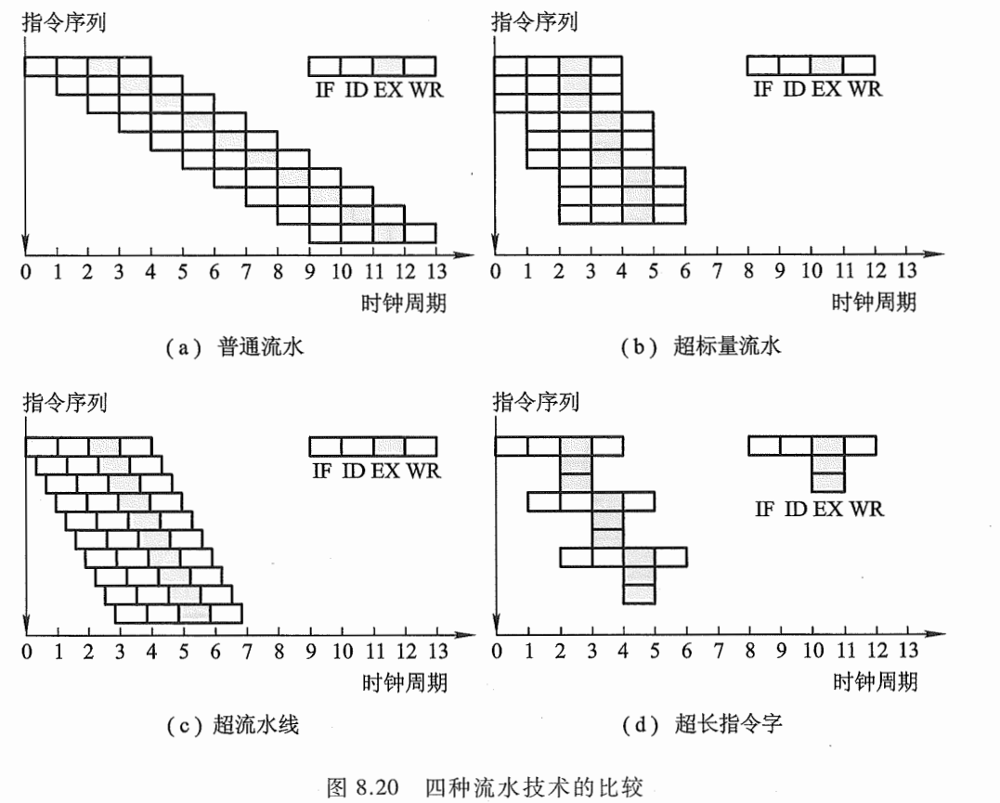

## 中断屏蔽字

4、P367 中断源优先级调整 表8.8  根据优先级写屏蔽字

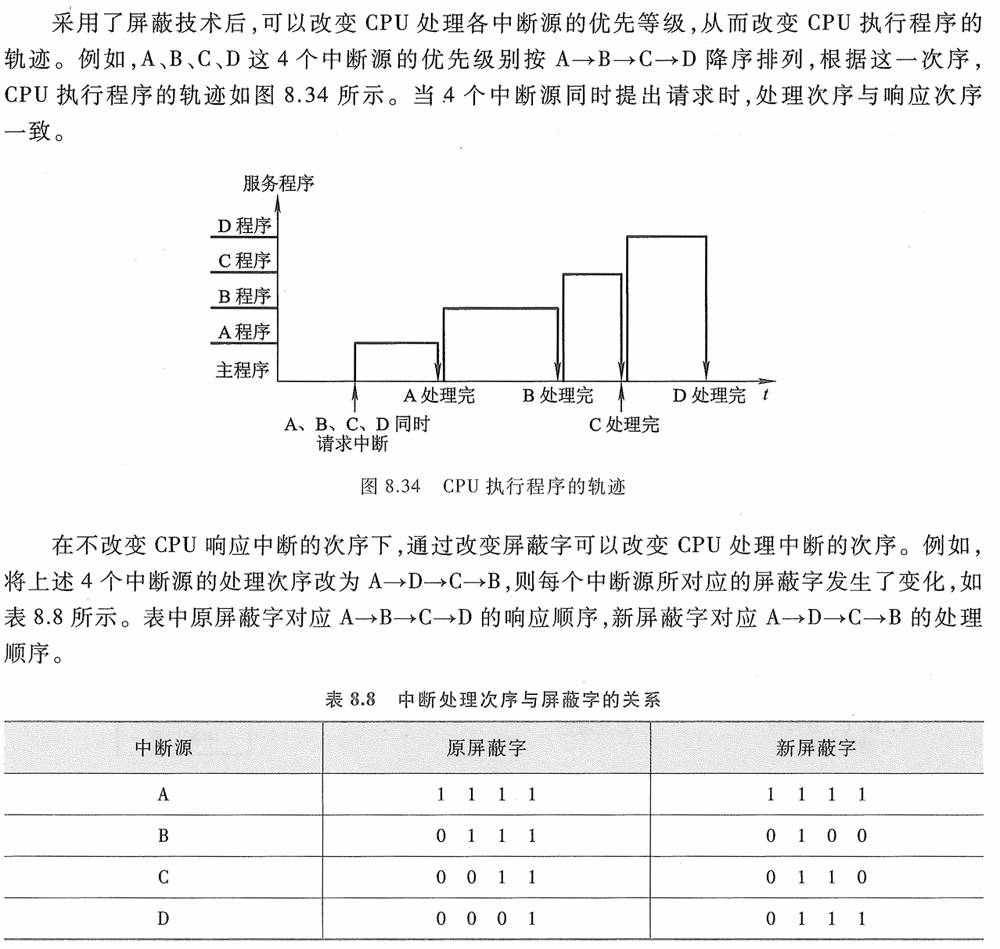

5、P343 指令周期，中断周期在执行周期之后。

# 第9章 控制单元功能

## 指令周期的定义

什么是指令周期。

CPU 取出并执行一条指令所需的全部时间。

取指令的命令，取指周期的相同性

p378 中断周期。

P385 多级时序周期最小单位是时钟周期，之上机器周期 ，之上指令周期。

数据和地址是由什么部件进行区分的?CU

指令周期。

取指周期的全部微操作：

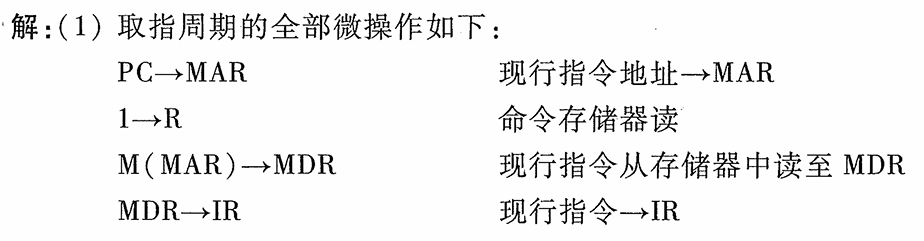

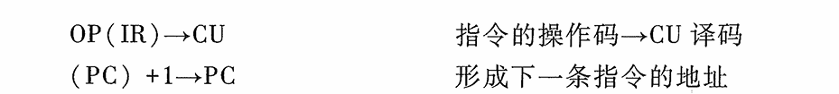

P383 例题9.2

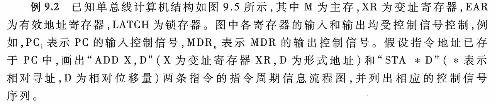

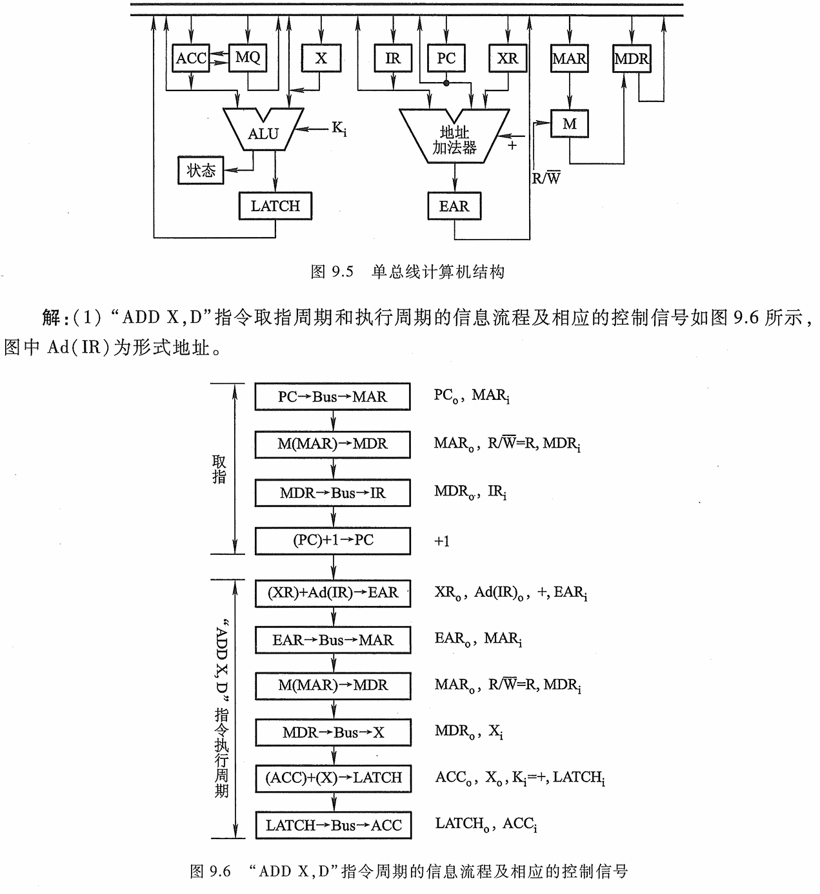

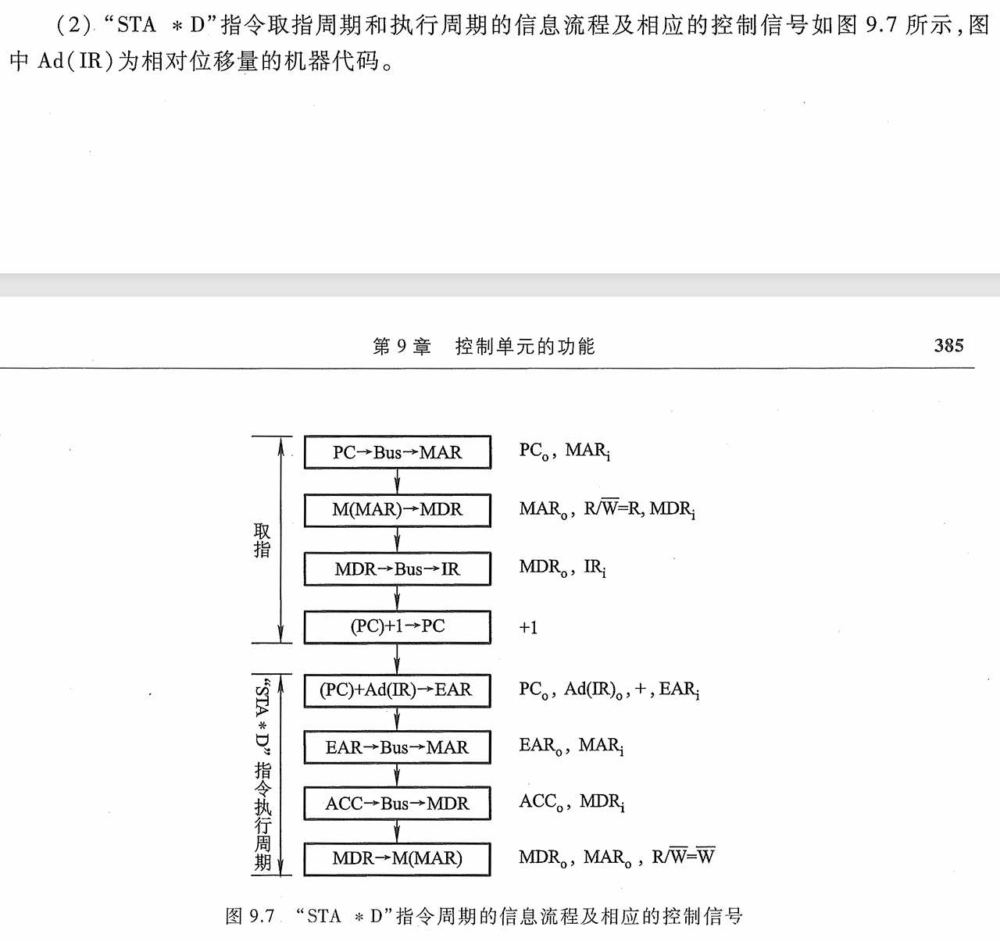

# 第10章 控制单元设计

## 微指令节拍

p396 微操作的节拍安排。每个周期 3 个节拍。

## 写指令

P398 写指令，例题 10.1.

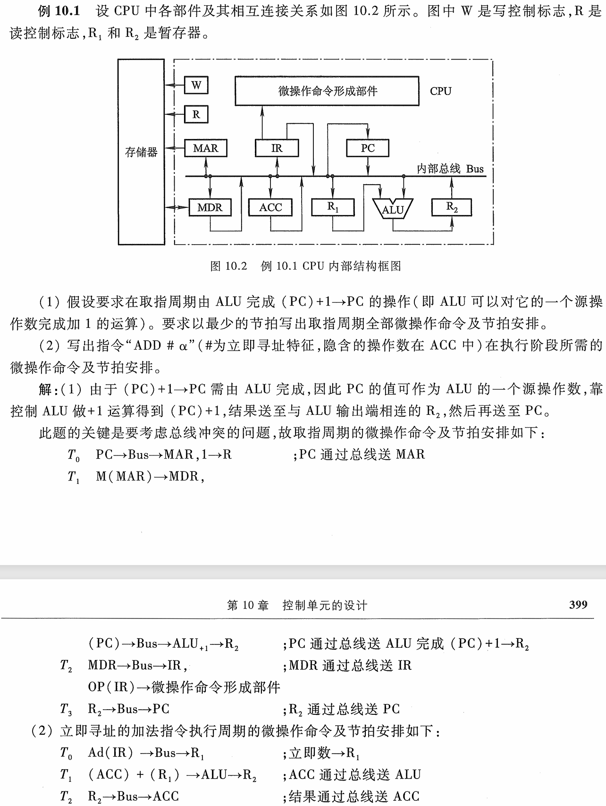

## 微指令的编码方式

p407 微指令的编码方式

1. 直接编码：每一位代表一个微操作命令；
2. 字段直接编码：将微指令的操作控制字段分成若千段，将一组互斥的微操作命令放在一个字段内，通过对这个字段译码，便可对应每一个微命令；
3. 字段间接编码；
4. 混合编码；
5. 其他。

## 水平、垂直型微指令

水平型微指令、垂直微指令特点，对比。

- 水平型微指令：一次能定义并执行多个并行操作的微命令；
- 垂直型微指令：采用类似**机器指令操作码**的方式，在微指令字中，设置微操作码字段，由微操作码规定微指令的功能；

比较：
1. 水平型微指令比垂直型微指令**并行**操作能力强、效率高、**灵活**性强；
2. 水平型微指令执行一条机器指令所需的微指令**数目少**，因此速度比垂直型微指令的速度快；
3. 水平型微指令用**较短的微程序结构**换取**较长的微指令结构**，垂直型微指令正相反，它以**较长的微程序结构**换取**较短的微指令结构**；
4. 水平型微指令与机器指令差别较大，垂直型微指令**与机器指令相似**。

## 微指令格式设计

P411-412  采用字段直接编码控制 计算控制字段位数 例题 105 10.6 计算。

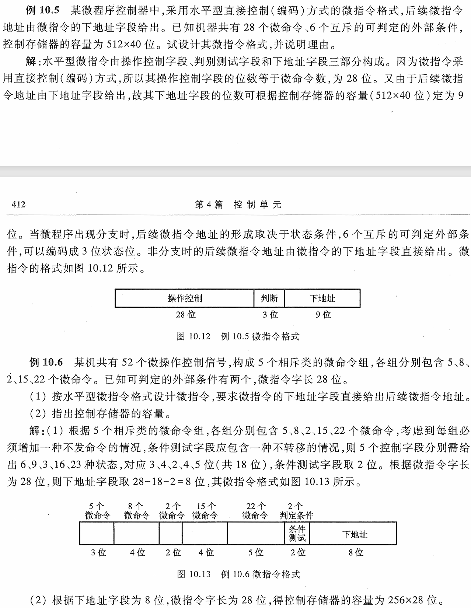

p414 10.2.9 微程序设计举例。

P411 垂直微指令特点。