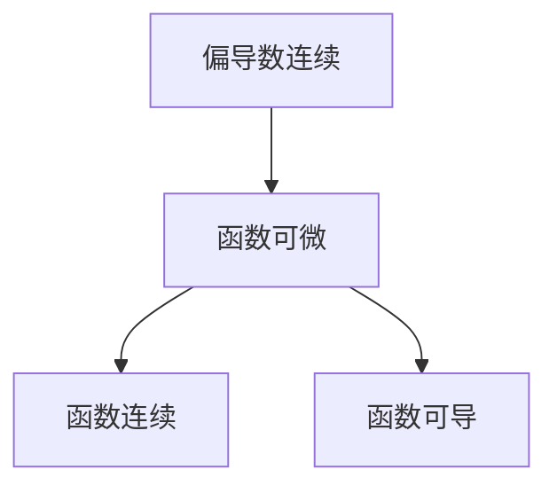

# 微分方程

要求出一个微分方程的通解，即求一个使得方程成立的 $y=f(x, y)$ 表达式<!--more-->

## 一阶线性微分方程

一阶，指的是方程中关于 $y$ 的导数是一阶导数；线性，指的是方程简化后的每一项关于 $y$、$y’$ 的次数为 0 或 1

一阶微分方程的标准形式
$$
\frac{\mathrm{d}y}{\mathrm{d}x}+P(x)y=Q(x)
$$

### 齐次的一阶线性微分方程

可分离变量的微分方程：如果可以化为这种形式，直接对方程两侧积分
$$
p(y)\mathrm{d}y=q(x)\mathrm{d}x
$$
相似的，如果 $\frac{\mathrm{d}y}{\mathrm{d}x}=f(x,y)$ 中的 $f(x, y)$ 可以表示为 $\phi(\frac{y}{x})$ 的函数，令 $u=\frac{y}{x}$，把方程用 $u$ 和 $x$ 表示，求解回代即可。

### 非齐次的一阶线性微分方程

对于型如
$$
\frac{\mathrm{d}y}{\mathrm{d}x}+P(x)y=Q(x)
$$
的非齐次的一阶线性微分方程，有通解
$$
y=e^{-\int P(x)\mathrm{d}x}[\int Q(x)e^{\int P(x)\mathrm{d}x}\mathrm{d}x+C]
$$

## 可降阶的二阶微分方程

就是积两次分
$$
y=\int[\int f(x)\mathrm{d}x]\mathrm{d}x
$$

## 常系数线性微分方程

### 齐次

先写出对应的特征方程，导数的阶数对应特征值的次数，解得特征值 $r_1$ 和 $r_2$，通解即为
$$
\begin{equation}
y=
\begin{cases}
C_1e^{r_1x}+C_2e^{r_2x} & r_1\neq r_2 \newline
C_1e^{r_1x}+C_2xe^{r_2x} & r_1=r_2 \newline
e^{\alpha x}(C_1 \sin \beta x+C_2\cos \beta x) & r_1r_2=\alpha \pm \beta \mathrm{i}
\end{cases}
\end{equation}
$$

### 非齐次

求出特征解，加上对应的通解。

# 向量

## 点乘（数量积）

$$
\boldsymbol{a}\cdot\boldsymbol{b}=ab\cos\theta
$$

## 叉乘（向量积）

大小为
$$
|\boldsymbol{a}\times\boldsymbol{b}|=ab\sin\theta
$$
方向为从 $\boldsymbol{a}$ 旋转到 $\boldsymbol{b}$ 的右手螺旋大拇指方向。显然，叉乘不满足交换律。

用行列式求向量积
$$
\boldsymbol{a}\times\boldsymbol{b}=
\left| 
\begin{array}{cccc}
\boldsymbol{i} & \boldsymbol{j} & \boldsymbol{k} \newline
 x_a & y_a & z_a\newline
x_b & y_b & z_b
\end{array} 
\right|
$$

## 混合积

混合积又数量积和向量积复合而来
$$
\boldsymbol{c}\cdot(\boldsymbol{a}\times\boldsymbol{b})=(ab\sin\alpha)c\cos\gamma
$$
几何意义是三边对应平行六面体的体积。

# 直线和平面

## 直线的表示

空间中直线可以通过一个参数确定另外两个参数，因此注定空间中直线有两个方程。设直线过一点 $(x_0,y_0,z_0)$，方向向量为 $(a,b,c)$，那么有两种表示方法：

点向式
$$
\frac{x-x_0}{a}=\frac{y-y_0}{b}=\frac{z-z_0}{c}
$$
参数方程
$$
\begin{cases}
x=x_0+at \newline
y=y_0+bt \newline
z=z_0+ct
\end{cases}
$$
此外，也可以理解为线是两平面的交集。

## 平面的表示

点法式，设平面过一点 $(x_0,y_0,z_0)$，法向量为 $(a,b,c)$
$$
a(x-x_0)+b(y-y_0)+c(z-z_0)=0
$$
一般式
$$
Ax+By+Cz+D=0
$$

## 点到线面的距离

其他都可以转换成这两种。

点到直线：给定空间中直线 $l$ , 其方向向量为 $\boldsymbol{n}$，$A$为 $l$ 外一点，若要求 $A$ 到直线 $l$ 的距离 $d$，可任取 $l$ 上一点 $B$ , 点 $A$ 到点 $B$ 的向量记作 $m$，则
$$
d=\frac{|\boldsymbol{m}\times\boldsymbol{n}|}{|\boldsymbol{n}|}
$$
点到平面
$$
d=\frac{|Ax_0+By_0+Cz_0+D|}{\sqrt{A^2+B^2+C^2}}
$$

## 曲线切向量

设曲线
$$
\begin{cases}
x=\phi(t) \newline
y=\psi(t) \newline
z=\omega(t)
\end{cases}
$$

则在点 $(x_0,y_0,z_0)$ 处的一个切向量为
$$
(\phi'(t)x_0,\psi'(t)y_0,\omega'(t)z_0)
$$

## 曲面法向量

设平面
$$
F(x,y,z)=0
$$
则在点 $(x_0,y_0,z_0)$ 处的一个法向量为
$$
(F_x'x_0,F_y'y_0,F_z'z_0)
$$

# 偏导

## 多元函数连续、可导、可微的关系

## 偏导数的计算

一般求法：求函数对某一个自变量的偏导数时，把其他自变量当作常量对该自变量求导。

### 二阶导

顾名思义，求偏导后再求偏导，求两次。

如果二阶混合偏导连续，则与求导顺序无关，即
$$
\frac{\partial^2z}{\partial x\partial y}=\frac{\partial^2z}{\partial y\partial x}
$$

### 多元复合函数求导

条件：$z=f(u,v)，u=u(t),v=v(t)$

画出关系图，按照广度优先搜索求导：
$$
\frac{\mathrm{d}z}{\mathrm{d}t}=\frac{\partial z}{\partial u}\frac{\mathrm{d}u}{\mathrm{d}t}
+\frac{\partial z}{\partial v}\frac{\mathrm{d}v}{\mathrm{d}t}
$$

### 隐函数求导

公式
$$
\frac{\mathrm{d}y}{\mathrm{d}x}=-\frac{F_x}{F_y}
$$

# 全微分

$y=f(x)$，微分为
$$
\mathrm{d}y=\frac{\mathrm{d}y}{\mathrm{d}x}\mathrm{d}x
$$
$z=f(x,y)$，全微分为
$$
\mathrm{d}z=\frac{\partial z}{\partial x}\mathrm{d}x+\frac{\partial z}{\partial y}\mathrm{d}y
$$
