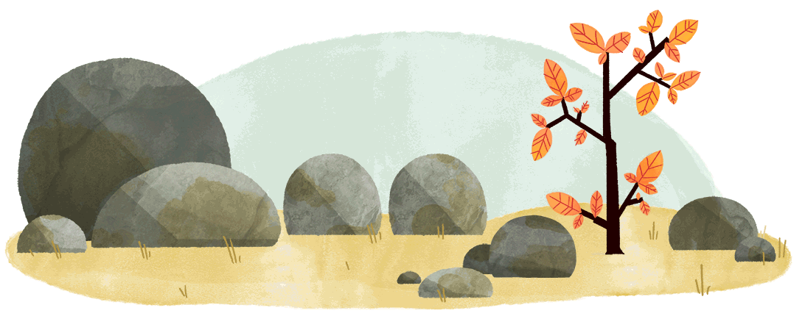

# 关于我

John, Apache GraphAr (incubating) PPMC.

喜欢编程、折腾和思考，热爱开源。

---

# 关于本站

## 站名

Spica ，中文名「角宿一」，室女座 $\alpha$ 星。北半球春季的夜晚，你能在东南的夜空看见它淡蓝的身影。我喜欢这颗星星，因此以 The Spica 命名本站。

## 建站

始建于 2023 年初。前端基于 [Hexo](https://hexo.io/) 框架，主题为 [Even](https://github.com/ahonn/hexo-theme-even)；项目托管在 [GitHub](https://github.com/)；由 [Netlify](https://www.netlify.com/) 提供静态网站部署；[Cloudflare](https://www.cloudflare.com/zh-cn/) 提供 CDN 加速。

2023-9-23：八月域名到期，出于经济和安全考虑不愿再续。将静态网页发布到 gh-pages 分支，并通过 GitHub Pages 部署，因此域名也迁移为 [thespica.github.io](https://thespica.github.io/)。